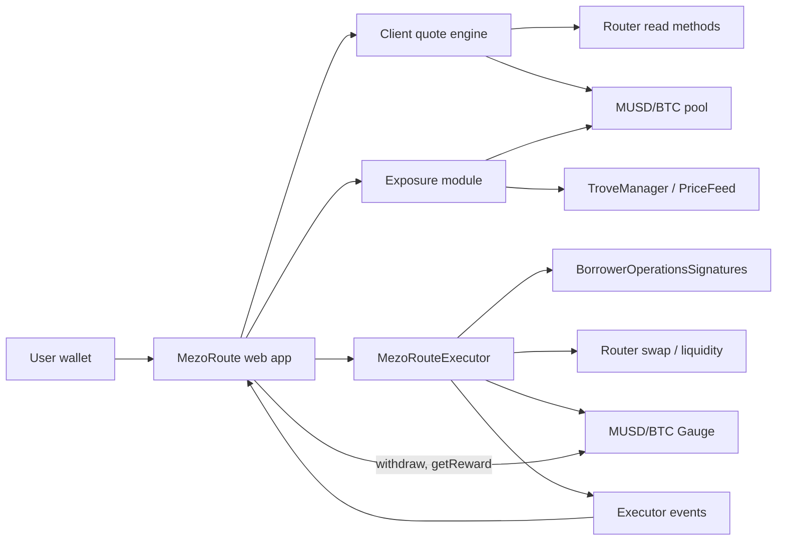

# MezoRoute — Product & Technical Specification

**Hackathon:** Build with MUSD and MEZO — Bitcoin's Economic Layer (AKINDO WaveHack)  
**Version:** 2.0  
**Status:** Scope agreed for Wave 1 and Wave 2  
**Track:** Track 1 — DeFi (Borrowing, Lending, Looping, and Yield)  
**Network:** Mezo Testnet (chain ID `31611`) in Wave 1; Mezo mainnet added in Wave 2  
**Team:** Solo builder  
**Primary persona:** A Mezo borrower who holds, or can borrow, MUSD against BTC

---

## 1. Executive decision

MezoRoute is a **safe execution layer for the MUSD lifecycle on Mezo**: borrow MUSD against BTC, deploy it into the MUSD/BTC pool, stake into the gauge to earn MEZO, understand the combined BTC risk, and exit back to MUSD — each step previewed before signing, constrained on-chain, and reported from transaction events.

The product is built across both Waves as one project:

| Wave | Build period | Theme |
|---|---|---|
| Wave 1 | 16 Oct – 26 Oct 2026 (deadline 26 Oct 22:00) | Deep Mezo integration on testnet: borrow → LP → gauge → MEZO, with a combined-exposure view |
| Wave 2 | 2 Nov – 15 Nov 2026 | Hardening, mainnet deployment, CR/exposure alerts, judge feedback |

Work is organised as a task backlog (Section 16), not a day-by-day schedule. When the Wave 1 gate is met early, Wave 2 tasks that do not depend on judge feedback start immediately on a separate branch.

Non-negotiable product rules:

- The UI never presents wallet-balance changes as strategy profit.
- No unverified APY, simulated yield, arbitrary routing, or automated rebalancing.
- User funds never rest in MezoRoute contracts between transactions.
- The only revenue is a disclosed execution fee on entry, fixed at deployment and shown before signing (Section 19.1).

## 2. Problem

A Mezo user who wants to put borrowed MUSD to work faces four problems:

1. **Fragmented flow.** Borrowing, adding liquidity, and staking into a gauge are separate apps, approvals, and transactions.
2. **Execution risk.** A quoted route can suffer price impact, slippage, deadline expiry, or poor liquidity.
3. **Hidden compounding of BTC risk.** A user who borrows MUSD against BTC and deposits it into a MUSD/BTC pool **increases** their BTC exposure. A BTC drawdown lowers both the Trove collateral ratio and the LP position value at the same time. No existing interface shows these two together.
4. **Misleading accounting.** Wallet balance deltas can include unrelated token movements. For example, Velodrome-style routers (including Mezo's Tigris Router) return any balance already held by the Router to the current caller during a zap. On testnet we observed a zap that returned `10.465776660570163868 MUSD` of pre-existing Router balance, which a naïve dashboard would report as profit. MezoRoute therefore derives every reported number from its own events, not from wallet deltas.

## 3. Target user and job to be done

### Primary persona

A retail DeFi user who:

- holds BTC on Mezo and has, or is willing to open, a Trove;
- understands deposit, withdraw, collateral ratio, and slippage at a basic level;
- does not want to manually calculate pool ratios, Trove hints, or inspect transaction logs;
- wants transparent, non-custodial control rather than a managed vault;
- uses an EVM wallet (e.g. MetaMask) on desktop.

### Job to be done

> When I want to put my BTC-backed MUSD to work, show me the real outcome and the combined BTC risk before I sign, execute only within my limits in as few steps as possible, and show me exactly what my transaction produced.

## 4. Research evidence and product decisions

| Finding | Evidence | Product decision |
|---|---|---|
| Borrowing MUSD on Mezo testnet works | Verified borrow transaction and live Trove state | Read Trove state; borrow through Mezo's own contracts, never a custom market |
| `BorrowerOperationsSignatures` exposes `withdrawMUSDWithSignature(amount, …, borrower, recipient, signature, deadline)` | MUSD repository source | A contract can execute a borrow on the user's behalf with one EIP-712 signature, enabling borrow → LP → stake in one transaction |
| The signature binds `amount`, `borrower`, `recipient`, `nonce`, `deadline` only, and anyone may submit it | Source: `_verifySignature` uses `ECDSA.recover` and increments `nonces[borrower]` | Borrowed MUSD is always sent to the **user**, never to the executor (see Section 11.4). Only EOA signers are supported for this flow |
| MUSD implements EIP-2612 `permit` | `MUSD is ERC20Permit` | Replace approval transactions with permit signatures |
| `Gauge.deposit(amount, recipient)` stakes on behalf of another address | Tigris `Gauge.sol` | The executor can stake LP directly for the user |
| `Gauge.withdraw` and `Gauge.getReward` act only for `msg.sender` (or the Voter) | Tigris `Gauge.sol` | Unstaking and claiming MEZO are called by the user directly on the gauge, not through the executor |
| MUSD/BTC basic LP supports a full entry and exit | Verified 20 MUSD round trip returning `19.988002574284855609 MUSD` | Only executable route; show attributable execution cost |
| MUSD/mUSDC is imbalanced and MUSD/mUSDT has no liquidity on testnet | Live reserve inspection | Not offered |
| Testnet gauge reward rate was zero during research | Contract read | Show real mainnet pool/gauge data read-only; never extrapolate testnet yield |
| Generic Router zap returns pre-existing Router balances to the caller | Receipts and Router source | Build from exact swap/liquidity primitives with before/after delta isolation |

## 5. Goals and success criteria

### Product goals

- Turn borrow → LP → stake from roughly six separate actions into **one transaction and two off-chain signatures**.
- Make the combined Trove + LP BTC exposure visible before and after every action.
- Prevent execution outside user-defined minimums and deadlines.
- Attribute every displayed result to the current transaction.

### Wave 1 success criteria

1. A user can complete `MUSD → LP (optionally staked) → MUSD` from the UI.
2. A user with an existing Trove can complete `borrow → LP → stake` in one executor transaction.
3. A user can claim MEZO gauge rewards from the UI (a zero balance is displayed honestly as zero).
4. Entry and exit each execute atomically or revert completely.
5. Preview displays expected output, minimum output, price impact/execution loss, gas estimate, resulting collateral ratio, and key risks.
6. The exposure panel shows total BTC exposure and the effect of a 10/20/30% BTC drawdown on both collateral ratio and LP value.
7. Receipts are derived from executor events.
8. The executor holds no user-attributable tokens or allowances after any successful call.
9. Contract tests cover happy paths, slippage reverts, expiry, residual isolation, reentrancy, signature misuse, and accounting invariants.

### Demo-level UX targets

- The primary action is reachable within three screens after wallet connection.
- A first-time user can explain what they receive and the main risks before confirming.
- Errors provide a recovery action rather than only an RPC message.

## 6. Scope

### Wave 1 — Must (required to be eligible)

- Wallet connection and Mezo testnet network handling.
- MUSD, native BTC gas, LP, and staked-LP balances.
- Trove summary (collateral, debt, collateral ratio) when a Trove exists.
- MUSD/BTC strategy detail and risk explanation.
- Live entry and exit quotes.
- Safe atomic entry and exit through `MezoRouteExecutor`.
- Position view.
- Event-based receipts with explorer links.
- Wrong-network, rejected-signature, and slippage-revert states.
- README, deck, 2-minute video, submission form.

### Wave 1 — Should (scoring features, in priority order)

- Permit-based entry (no approval transaction) and optional stake-on-entry.
- Unstake and claim MEZO from the position screen.
- `borrowAndEnter`: borrow → LP → stake in one transaction.
- Borrow & Deploy screen.
- Exposure module and drawdown panel.
- Basic fuzz and invariant tests.
- Read-only mainnet MUSD/BTC pool and gauge card (the only place judges see real fees and MEZO emissions).

### Wave 1 — Could (cut first if late)

- Remaining error states from Section 13.

### Wave 2

- Full invariant suite and self-audit checklist.
- Mainnet deployment with an immutable per-transaction amount cap.
- Telegram alerts when collateral ratio or combined exposure crosses a user threshold.
- Changes driven by Wave 1 judge feedback.

### Out of scope

- Opening a new Trove through the executor (users open Troves in the Mezo app; considered after Wave 2).
- Smart-account / ERC-1271 signers for `borrowAndEnter`.
- Cross-chain MUSD.
- Arbitrary tokens, pools, or user-provided routes.
- Concentrated liquidity.
- veMEZO voting or bribes.
- Automated compounding or rebalancing.
- Custodial deposits, fiat on-ramp, governance, backend accounts.
- Any APY figure not computed from verifiable on-chain data.

## 7. User flows

### Flow A — Connect and assess readiness

1. User connects an EVM wallet; the app requests Mezo testnet.
2. App reads wallet MUSD, BTC gas, LP, staked LP, earned MEZO, and Trove state.
3. App shows one of:
   - **Ready:** sufficient MUSD and gas;
   - **Can borrow:** has a Trove with borrowing headroom;
   - **Needs gas:** insufficient BTC for transactions;
   - **No MUSD and no Trove:** links to the Mezo app to open a Trove;
   - **Trove at risk:** persistent warning before any deposit action.

The app never blocks use of wallet-held MUSD because of Trove health, but the warning is explicit and persistent.

### Flow B — Deposit wallet MUSD

1. User selects **MUSD/BTC Liquidity**, enters an amount, and chooses whether to stake into the gauge.
2. App fetches fresh reserves and quotes, and shows:
   - input MUSD, portion swapped, expected BTC;
   - expected MUSD and BTC deposited, expected and minimum LP;
   - MezoRoute execution fee (bps and MUSD amount);
   - estimated execution loss/price impact and gas;
   - quote timestamp and expiry;
   - exposure panel before/after;
   - risks: BTC exposure, impermanent loss, pool liquidity, smart-contract risk.
3. App blocks confirmation on zero input, insufficient balance or gas, expired quote, price impact above the hard limit, or chain/address mismatch.
4. User signs a MUSD permit (or, if the wallet cannot sign typed data, an exact approval transaction).
5. User signs `enter`.
6. Progress: awaiting signature → submitted → confirming → confirmed → receipt.
7. Receipt shows only `Entered` event values, gas used, and an explorer link.

### Flow C — Borrow & Deploy

Precondition: user has a Trove and uses an EOA wallet.

1. User enters an MUSD amount to borrow and deploy, and chooses whether to stake.
2. App shows everything in Flow B plus: new debt, resulting collateral ratio, and the minimum collateral ratio from the protocol.
3. App blocks confirmation if the resulting collateral ratio falls below a UI safety floor (default: MCR + 40 percentage points, configurable in constants).
4. App computes Trove hints and reads the user's signature nonce.
5. User signs two typed-data messages:
   - the MUSD borrow authorisation (`recipient` = the user's own address);
   - the MUSD permit to the executor.
6. User sends one `borrowAndEnter` transaction.
7. Receipt shows borrowed amount, LP minted or staked, residues, and the new Trove state read after confirmation.

### Flow D — Monitor position

1. App reads wallet LP, staked LP, and earned MEZO.
2. App estimates underlying MUSD and BTC from reserves and LP total supply.
3. App shows LP balances, underlying tokens, BTC exposure, estimated exit value in MUSD, attributable cost basis, and earned MEZO.
4. The difference from cost basis is labelled **estimated position value change**, never profit or APY.

### Flow E — Claim MEZO

User calls `gauge.getReward(user)` directly. The receipt shows the `ClaimRewards` amount; a zero reward is displayed as zero with an explanation that testnet emissions are currently inactive.

### Flow F — Exit to MUSD

1. If LP is staked, user unstakes the chosen amount by calling `gauge.withdraw` directly.
2. User selects an LP amount or **Max**.
3. App quotes removal amounts and the BTC→MUSD swap, and shows expected and minimum MUSD, price impact, and gas.
4. User signs an LP permit if the pool token supports it (confirmed in T0), otherwise an exact approval.
5. User signs `exit`.
6. Receipt shows realised, event-attributable MUSD output.

## 8. Functional requirements

| ID | Requirement | Acceptance criteria |
|---|---|---|
| FR-01 | Network validation | Write actions are disabled unless chain ID matches the configured network |
| FR-02 | Balance reads | MUSD, BTC gas, LP, staked LP, and earned MEZO refresh after each confirmed transaction |
| FR-03 | Trove read | Collateral, debt, and collateral ratio are displayed; a missing Trove is handled cleanly |
| FR-04 | Entry quote | Includes swap output, liquidity inputs, LP output, minimums, gas, and expiry |
| FR-05 | Risk gate | UI rejects zero input, stale quote, insufficient balances, price impact above the hard limit, and (for borrowing) a resulting CR below the safety floor |
| FR-06 | Minimal approvals | Permit by default; fallback approvals equal the exact transaction amount |
| FR-07 | Atomic entry | A failed borrow, swap, liquidity add, stake, minimum check, or deadline reverts the whole operation |
| FR-08 | Position reads | LP, staked LP, and estimated underlying amounts come from current chain state |
| FR-09 | Exit quote | Includes removal amounts, swap output, expected and minimum MUSD, gas, and expiry |
| FR-10 | Atomic exit | A failed removal, swap, minimum check, or deadline reverts the whole operation |
| FR-11 | Attributable receipt | Receipt values come from executor or gauge events, never from wallet delta alone |
| FR-12 | Residual isolation | Tokens held by the executor before a call cannot be transferred or credited to the caller |
| FR-13 | Explorer traceability | Every success receipt links to the explorer |
| FR-14 | Error recovery | Each error offers Retry, Refresh Quote, Switch Network, or Add Gas as appropriate |
| FR-15 | Exposure | Total BTC exposure and 10/20/30% drawdown scenarios are shown on dashboard and previews |
| FR-16 | Borrow & Deploy | One executor transaction borrows, deposits, and optionally stakes; borrowed MUSD never passes to any address other than the user and the executor |
| FR-17 | MEZO rewards | Earned MEZO is displayed and claimable |
| FR-18 | Execution fee | Entry fee is shown in bps and MUSD before signing, charged on-chain exactly as shown, emitted in `Entered`, and never charged on exit |

## 9. UX and screen specification

### Screen 1 — Dashboard

- Wallet/network control.
- MUSD, BTC gas, LP, and staked LP balances; earned MEZO.
- Trove card with collateral ratio.
- Exposure panel (Trove BTC + LP BTC, drawdown scenarios).
- Strategy card **MUSD/BTC Liquidity** with two actions: **Deposit MUSD** and **Borrow & Deploy**.
- Mainnet reference card: pool reserves, gauge emission rate — labelled "Mainnet · reference only".

### Screen 2 — Strategy detail

- Amount input with Max; stake toggle.
- "What happens" allocation visualisation.
- Expected outcome, cost and slippage, exposure before/after.
- Risk disclosures and quote expiry indicator.

Primary CTA: **Review transaction**

### Screen 3 — Confirmation

Must state the exact MUSD authorised (and borrowed, if any), the execution fee, expected and minimum LP, maximum deviation, deadline, resulting collateral ratio, number of signatures remaining, and a no-custody statement.

Primary CTA by state: **Sign permit** / **Sign borrow authorisation** / **Refresh quote** / **Enter position**

### Screen 4 — Transaction progress and receipt

States: awaiting signature, submitted, confirming, confirmed, failed. The receipt includes event fields, gas, block, and explorer link.

### Screen 5 — Position, rewards, and exit

- LP and staked LP balances, estimated underlying MUSD/BTC.
- Attributable cost basis and estimated exit value.
- Earned MEZO with **Claim**.
- **Unstake** (when staked), exit amount selector, exit quote and risks.

Primary CTA: **Review exit**

### Copy rules

- Never say "guaranteed", "risk-free", or "earn X%" without a verifiable on-chain source.
- Use "estimated" for all pre-transaction values and "realised" only after confirmation.
- Explain impermanent loss and the double BTC exposure in one sentence each before linking to detail.
- Visually and textually separate testnet execution data from mainnet reference data.

## 10. System architecture



### Stack

- **Contracts:** Solidity, Foundry, OpenZeppelin Contracts 5.x; fork tests against Mezo testnet RPC.
- **Frontend:** Next.js (static export), TypeScript, wagmi + viem, TanStack Query, Tailwind CSS, Vitest.
- **Hosting:** static hosting; no backend in Wave 1. The Wave 2 Telegram alert service is the only server component.

### Frontend module layout

```
src/lib/config/            chain, addresses (allowlist), constants
src/lib/routes/musd-btc/   quote, build params, receipt decoding (per route)
src/lib/exposure/          pure functions: total BTC exposure, drawdown scenarios
src/lib/trove/             Trove reads, hints, signature nonce, EIP-712 typed data
src/lib/gauge/             staked balance, earned, unstake, claim
src/lib/tx/                transaction state machine
src/app/                   screens
```

Receipt decoding and quoting live under a per-route directory so that Wave 2 and later routes add a directory rather than modify the existing one.

## 11. Smart contract specification

### 11.1 Fixed dependencies

All dependencies are immutable constructor arguments; the executor accepts no user-supplied addresses other than `recipient`.

Fee configuration is also immutable:

| Parameter | Value |
|---|---|
| `feeBps` | Set at deployment; proposed 10 bps (0.10%) |
| `MAX_FEE_BPS` | Constant 50 bps; constructor reverts above it |
| `feeRecipient` | Set at deployment; non-zero |

Changing the fee requires deploying a new executor; the frontend allowlist pins the executor address and its fee.

| Dependency | Mezo testnet address |
|---|---|
| MUSD | `0x118917a40FAF1CD7a13dB0Ef56C86De7973Ac503` |
| BTC (ERC-20 interface) | `0x7b7C000000000000000000000000000000000000` |
| Basic Router | `0x9a1ff7FE3a0F69959A3fBa1F1e5ee18e1A9CD7E9` |
| PoolFactory | `0x4947243CC818b627A5D06d14C4eCe7398A23Ce1A` |
| MUSD/BTC pool (volatile) | `0xd16A5Df82120ED8D626a1a15232bFcE2366d6AA9` |
| MUSD/BTC gauge | Confirmed in task T0 |
| BorrowerOperationsSignatures | Confirmed in task T0 |

### 11.2 Public interface

```solidity
interface IMezoRouteExecutor {
    struct Permit {
        uint256 value;      // 0 = skip permit, use existing allowance
        uint256 deadline;
        uint8 v;
        bytes32 r;
        bytes32 s;
    }

    struct Borrow {
        uint256 amount;
        address upperHint;
        address lowerHint;
        bytes signature;
        uint256 deadline;
    }

    struct EnterParams {
        uint256 musdIn;
        uint256 musdToSwap;
        uint256 minBtcFromSwap;
        uint256 minMusdAdded;
        uint256 minBtcAdded;
        uint256 minLpOut;
        uint256 deadline;
        address recipient;
        bool stake;
    }

    struct ExitParams {
        uint256 liquidityIn;
        uint256 minMusdRemoved;
        uint256 minBtcRemoved;
        uint256 minMusdFromSwap;
        uint256 minMusdOut;
        uint256 deadline;
        address recipient;
    }

    function enter(EnterParams calldata p, Permit calldata musdPermit)
        external returns (uint256 liquidityOut);

    function borrowAndEnter(Borrow calldata b, Permit calldata musdPermit, EnterParams calldata p)
        external returns (uint256 liquidityOut);

    function exit(ExitParams calldata p, Permit calldata lpPermit)
        external returns (uint256 musdOut);
}
```

### 11.3 Entry algorithm (`enter`, and the tail of `borrowAndEnter`)

1. Revert on zero input, zero recipient, or expired deadline.
2. Snapshot executor MUSD, BTC, and LP balances.
3. If `musdPermit.value > 0`, call `permit` inside `try/catch` (a front-run permit must not block the call).
4. Pull exactly `musdIn` from `msg.sender`.
5. Compute `fee = musdIn × feeBps / 10_000` (rounded down) and transfer it to `feeRecipient`. All following steps operate on `musdIn − fee`; the frontend computes `musdToSwap` and minimums on this net amount.
6. Approve exactly `musdToSwap` to the Router; swap MUSD→BTC on the fixed volatile route to the executor.
7. Require BTC delta ≥ `minBtcFromSwap`.
8. Approve exact transaction-attributable MUSD/BTC to the Router; call `addLiquidity`:
   - `stake = false`: mint LP to `recipient`;
   - `stake = true`: mint LP to the executor, approve exactly the LP delta to the gauge, call `gauge.deposit(lpDelta, recipient)`.
9. Require used amounts and LP output to satisfy all minimums.
10. Return transaction-attributable MUSD/BTC residue to `recipient`.
11. Reset all allowances to zero.
12. Assert final executor balances are not below their snapshots.
13. Emit `Entered`.

### 11.4 `borrowAndEnter`

1. Require `p.recipient == msg.sender` and `p.musdIn == b.amount`.
2. Call `BorrowerOperationsSignatures.withdrawMUSDWithSignature(b.amount, b.upperHint, b.lowerHint, msg.sender, msg.sender, b.signature, b.deadline)` — borrower **and recipient are the caller**.
3. Continue with steps 3–13 of Section 11.3 (the execution fee applies).

**Why the recipient is the user, not the executor.** The borrow signature can be submitted by anyone. If it named the executor as recipient, an attacker could copy it from the mempool and call Mezo directly: the user's debt would increase and the MUSD would land in the executor as a pre-existing balance that, by design, nobody can withdraw. With the user as recipient, a front-run only delivers the borrowed MUSD to the user's own wallet; the executor call then reverts on the consumed nonce and the user can deposit through `enter`.

Requiring `msg.sender == borrower` also prevents a third party from using a leaked signature with weaker minimums.

Whether the recipient receives exactly `amount` (with fees added to debt) is verified in a fork test in T9; if not, step 1 is changed to compare against the measured MUSD delta.

### 11.5 Exit algorithm

1. Revert on zero LP input, zero recipient, or expired deadline.
2. Snapshot executor MUSD, BTC, and LP balances.
3. Optional LP permit in `try/catch`; pull exactly `liquidityIn` LP.
4. Approve exact LP to the Router; `removeLiquidity` to the executor.
5. Require removal deltas ≥ `minMusdRemoved` and `minBtcRemoved`.
6. Swap only the transaction-attributable BTC delta to MUSD.
7. `musdOut = finalMUSD - startingMUSD`; require `musdOut ≥ minMusdOut` and swap output ≥ `minMusdFromSwap`.
8. Transfer exactly `musdOut` and any attributable BTC dust to `recipient`.
9. Reset allowances to zero; emit `Exited`.

Staked LP must be unstaked by the user first (`Gauge.withdraw` acts only for `msg.sender`).

### 11.6 Events

```solidity
event Entered(
    address indexed caller,
    address indexed recipient,
    uint256 musdBorrowed,   // 0 for enter()
    uint256 musdIn,
    uint256 fee,
    uint256 musdSwapped,
    uint256 btcFromSwap,
    uint256 musdAdded,
    uint256 btcAdded,
    uint256 liquidityOut,
    bool staked,
    uint256 musdRefund,
    uint256 btcRefund
);

event Exited(
    address indexed caller,
    address indexed recipient,
    uint256 liquidityIn,
    uint256 musdRemoved,
    uint256 btcRemoved,
    uint256 musdFromSwap,
    uint256 musdOut,
    uint256 btcRefund
);
```

### 11.7 Custom errors

`ZeroAmount()`, `ZeroAddress()`, `Expired()`, `NotBorrower()`, `BorrowAmountMismatch()`, `InsufficientSwapOutput()`, `InsufficientLiquidityOutput()`, `InsufficientFinalOutput()`, `UnexpectedBalanceDecrease()`

### 11.8 Security invariants

1. Only the fixed MUSD, BTC, Router, pool, gauge, and BorrowerOperationsSignatures are called.
2. No arbitrary call target, token, or route is accepted.
3. All state-changing entry points are `nonReentrant`.
4. All token transfers use `SafeERC20`.
5. Every allowance is exact and reset to zero before the call returns.
6. Minimums and deadlines are enforced on-chain.
7. Pre-existing executor balances can never be transferred or credited to the caller.
8. After any successful call the executor holds no transaction-attributable MUSD, BTC, or LP.
9. Borrowed MUSD is only ever sent to the borrower; `borrowAndEnter` is callable only by the borrower.
10. No upgrade proxy, owner, pause, or admin withdrawal path.
11. The fee is charged only on entry, equals `musdIn × feeBps / 10_000`, never exceeds `MAX_FEE_BPS`, and is only ever sent to the immutable `feeRecipient`.
12. (Wave 2, mainnet) An immutable per-transaction `musdIn` cap.

## 12. Frontend data and accounting rules

### Source of truth hierarchy

1. Confirmed executor and gauge events.
2. Decoded transaction logs.
3. Current contract reads.
4. Client-side estimates.

Wallet balance deltas are never the source for entry cost, LP minted, rewards, or exit output.

### Cost basis

- Cost basis = `Entered.musdIn − Entered.musdRefund` (plus BTC refund valued at entry price, shown separately). The execution fee is part of cost basis and is also shown as its own line.
- LP acquired = `Entered.liquidityOut`.
- Partial exits reduce cost basis pro rata by LP exited. This is a UX estimate, not tax accounting.
- Cost basis is reconstructed client-side from the user's `Entered`/`Exited` logs; no backend.

### Exposure model

Inputs: Trove collateral (BTC) and debt (MUSD); BTC price from the MUSD `PriceFeed`; minimum collateral ratio from the protocol; LP and staked LP balances; pool reserves and total supply.

- LP underlying BTC = `(lp + stakedLp) / totalSupply × reserveBTC`.
- Total BTC exposure = Trove collateral + LP underlying BTC.
- For drawdown `d ∈ {10%, 20%, 30%}`, with `p' = p × (1 − d)`:
  - collateral ratio' = `collateral × p' / debt`;
  - LP value' (MUSD) ≈ `LP value × √(1 − d)` (constant-product, fees ignored; labelled as an approximation);
  - flag when collateral ratio' < minimum collateral ratio.

The exposure module is pure TypeScript with unit tests; it is reused by the Wave 2 alert service.

### Quote expiration, slippage, and limits

- Quote lifetime 60 seconds; transaction and signature deadline now + 10 minutes.
- Refresh quote after each signature and on relevant block-state change.
- Slippage presets 0.5% / 1.0% (default) / 2.0%, strong warning at 2.0%, never silently increased.
- Price-impact hard limit starts at 5% and is finalised after integration tests.

## 13. Error-state requirements

| Condition | User message | Recovery |
|---|---|---|
| Wrong network | "MezoRoute executes on Mezo Testnet." | Switch network |
| Insufficient BTC gas | "You need test BTC to submit transactions." | Open faucet |
| Insufficient MUSD | "Amount exceeds your available MUSD." | Use Max, or Borrow & Deploy |
| Trove health warning | "Using borrowed MUSD does not reduce your debt, and this deposit adds BTC exposure." | Review exposure |
| CR below safety floor | "This borrow would leave your Trove too close to liquidation." | Reduce amount |
| Smart-account wallet on Borrow & Deploy | "Borrow & Deploy needs a standard wallet signature." | Use Deposit MUSD |
| Borrow signature already used | "Your borrow authorisation was already used; the MUSD is in your wallet." | Deposit MUSD |
| Quote expired | "Pool state changed; refresh your quote." | Refresh quote |
| Price impact too high | "This trade would lose too much value at current liquidity." | Reduce amount |
| User rejected signature | "Transaction was not signed." | Try again |
| Slippage revert | "Output fell below your minimum." | Refresh quote |
| RPC unavailable | "Mezo testnet is temporarily unavailable." | Retry |
| Unknown revert | Human-readable fallback plus shortened error data | Retry or copy details |

## 14. Test plan

### Contract unit and fork tests

- `enter` and `exit` happy paths, with and without stake.
- `borrowAndEnter` happy path against a real testnet Trove (fork).
- Zero input, zero recipient, expired deadline.
- Insufficient swap output, liquidity, and final output.
- Permit: valid, front-run (already used), and skipped (`value = 0`).
- Borrow signature: wrong caller, amount mismatch, replayed nonce, expired.
- Front-run simulation: signature submitted directly to Mezo first → MUSD arrives in user wallet, executor call reverts, executor balances unchanged.
- Execution fee: exact amount, rounding on small inputs, sent only to `feeRecipient`, constructor reverts above `MAX_FEE_BPS`, no fee on `exit`.
- Allowance reset to zero for Router and gauge.
- Residue refund; reentrancy attempt.
- Executor pre-seeded with MUSD, BTC, and LP: caller cannot receive or be credited for them.
- Full `MUSD → LP → MUSD` round trip reproducing the 20 MUSD research result without `zapIn`/`zapOut`.

### Fuzz and invariant tests

- Caller never receives more than transaction-attributable deltas.
- Executor post-balances ≥ pre-balances for all tokens.
- Emitted values match Router returns and balance deltas.
- No successful call leaves a non-zero allowance.

### Frontend tests (Vitest)

- Exposure module (all formulas and edge cases: no Trove, no LP, zero debt).
- Transaction state machine.
- Receipt decoding for `Entered`, `Exited`, `ClaimRewards`.

## 15. Definition of done

### Wave 1 gate

- `MezoRouteExecutor` deployed and source-verified on Mezo testnet.
- All Must and Should tasks complete; contract tests pass.
- A fresh wallet completes deposit → stake → unstake → exit, and borrow & deploy, from the UI.
- README includes setup, architecture, deployed addresses, limitations, and demo links.
- 2-minute video recorded from the final deployment.
- Repository tagged `wave1`; submission sent before 26 Oct 22:00 with one day of buffer.

### Wave 2 gate

- Mainnet deployment with per-transaction cap, verified, with at least one real round trip.
- Telegram alerts working end-to-end.
- Submission explicitly lists changes since `wave1`.

## 16. Task backlog

Before 16 Oct only research is done; product code starts on 16 Oct.

### T0 — Pre-research (before 16 Oct)

- Testnet addresses for `BorrowerOperationsSignatures` and the MUSD/BTC gauge; gauge `isAlive`.
- Whether the pool LP token supports `permit`.
- Mainnet addresses for the pool and gauge; readable reward rate.
- MUSD `PriceFeed`, `TroveManager`, and `HintHelpers` testnet addresses.
- Ask the Mezo team on Discord whether testnet gauge emissions for MUSD/BTC can be activated during the event.
- Short user check: ask 3–5 Mezo Discord users how they use borrowed MUSD and how many steps it takes today; keep 1–2 quotes for the deck.
- Count the actions needed today in the Mezo app for borrow → LP → stake (for the deck comparison).

### Wave 1 — Must

| ID | Task | Depends on |
|---|---|---|
| T1 | Foundry scaffold and testnet fork harness | T0 |
| T2 | `enter`/`exit` core with residual-isolation tests; reproduce 20 MUSD round trip | T1 |
| T3 | Deploy and verify on testnet (redeploy final version after T12) | T2 |
| T4 | Frontend skeleton: wallet/network, balances, Trove read | — |
| T5 | Quote engine, entry flow, receipt decoding | T2, T4 |
| T6 | Position screen and exit flow | T5 |
| T7 | README, deck (step comparison, mainnet market data, value to Mezo, fee model, user quotes), 2-minute video, submission form | all |

### Wave 1 — Should (in order)

| ID | Task | Depends on |
|---|---|---|
| T8 | Permit, stake-on-entry, unstake, claim MEZO | T2, T6 |
| T9 | `borrowAndEnter` with EIP-712 fork tests | T8 |
| T10 | Borrow & Deploy screen | T9, T5 |
| T11 | Exposure module and drawdown panel | T4 |
| T12 | Basic fuzz and invariant tests | T9 |
| T14 | Mainnet reference card (pool reserves, gauge emission rate) | T4, T0 |

T9–T10 carry the highest schedule risk (EIP-712 typed data, Trove hints) and are scheduled immediately after T8 to leave recovery time.

### Wave 1 — Could (cut from the bottom when late)

| ID | Task |
|---|---|
| T13 | Remaining error states from Section 13 |

### Wave 2 — starts as soon as the Wave 1 gate is met, on a separate branch

| ID | Task | Depends on |
|---|---|---|
| W2-1 | Full invariant suite and self-audit checklist | Wave 1 gate |
| W2-2 | Mainnet deployment with immutable per-transaction cap | W2-1 |
| W2-3 | Telegram CR/exposure alerts reusing the exposure module | T11 |
| W2-4 | Judge feedback changes | Wave 1 results (~1 Nov) |

Wave 2 work must not be included in the Wave 1 submission.

## 17. Demo script (2 minutes)

1. Dashboard: Trove, balances, and the exposure panel showing current BTC exposure.
2. Borrow & Deploy 20 MUSD with stake on: preview shows LP, minimums, cost, resulting collateral ratio, and exposure after.
3. Sign two messages, send one transaction.
4. Event-based receipt and explorer link.
5. Position screen: staked LP, earned MEZO, drawdown scenarios.
6. Unstake and exit to MUSD; compare attributable input with realised output.
7. Close: one sentence on event-based accounting and the Wave 2 mainnet plan.

## 18. Known risks and mitigations

| Risk | Mitigation |
|---|---|
| Pool price moves between quote and execution | On-chain minimums and deadline |
| Impermanent loss and double BTC exposure | Plain-language disclosure; exposure panel; CR safety floor |
| Borrow signature front-run | Recipient is always the user; caller must be the borrower |
| Permit front-run | `try/catch` permit, fall back to existing allowance |
| Low or imbalanced liquidity | Hard price-impact gate |
| Router, pool, gauge, or MUSD contract risk | Fixed allowlist, narrow calls, transparent dependencies |
| Incorrect profit display | Event-based accounting |
| Pre-existing contract residues | Before/after delta isolation |
| Testnet emissions inactive | Honest zero display; mainnet reference data |
| Unaudited contract on mainnet (Wave 2) | Invariant suite, self-audit, immutable per-transaction cap |
| Solo schedule overrun | Task tiers with explicit cut order |
| RPC instability | Retryable reads, clear transaction state |

## 19. Submission positioning and business model

### 19.1 Business model

- **Execution fee:** a fixed number of basis points on the MUSD entering a position (`enter` and `borrowAndEnter`), proposed at 10 bps, hard-capped at 50 bps in the contract.
- **No exit fee:** users can always leave at zero protocol cost, which supports trust in a non-custodial product.
- **Transparency:** the fee is shown in bps and MUSD before signing, emitted in `Entered`, and immutable per deployment.
- **Active from Wave 1:** the testnet executor charges the same fee to demonstrate the model end to end; revenue starts with the Wave 2 mainnet deployment.
- **Value to Mezo:** every MezoRoute entry either mints new MUSD (Borrow & Deploy) or moves idle MUSD into the MUSD/BTC pool and its gauge — increasing MUSD demand and pool depth. The deck states this with mainnet MUSD supply and pool TVL figures.

### 19.2 Submission form

- **Category:** Borrowing and yield execution
- **TL;DR:** MezoRoute turns borrow MUSD → LP → stake for MEZO into one safe, previewed transaction and shows your combined BTC risk before you sign.
- **Track:** Track 1 — DeFi
- **Chain:** Mezo testnet (Wave 1), Mezo mainnet (Wave 2)
- **Business model:** disclosed execution fee in bps on entry; no exit fee (Section 19.1).
- **MUSD/MEZO usage:** borrows MUSD through `BorrowerOperationsSignatures`, deploys it into the MUSD/BTC pool, stakes LP into the gauge, and claims MEZO emissions.
- **Future milestones:**
  1. Wave 2 (by 15 Nov): mainnet deployment and Telegram CR/exposure alerts.
  2. After the hackathon: additional routes (e.g. Savings Vault) as separate executors, and Trove opening in the same flow.
  3. After the hackathon: smart-account support and an external audit before raising caps.

## 20. Deployment references

### Mezo testnet

- RPC: `https://rpc.test.mezo.org`
- Explorer: `https://explorer.test.mezo.org`
- Chain ID: `31611`
- Faucet: `https://faucet.test.mezo.org`

### Research transactions

- Borrow MUSD: `https://explorer.test.mezo.org/tx/0x2c6cb4f33d812a4d508500d923a1c9870242b2c1b0a72f39e81e3117133f60b4`
- Add collateral: `https://explorer.test.mezo.org/tx/0x4ad68ab5d9d7e29a3f3fe2fc34cbb053f97fcf4a98ca46517e30f0b26c3f1486`
- Router zap-in: `https://explorer.test.mezo.org/tx/0xd6fd1d2df28927ca9b621cb1ed13904529ca252322e92cc66d14bfaefdf1a3a1`
- Router zap-out: `https://explorer.test.mezo.org/tx/0x1dbd96372d9ab272aa125a13d7a1d3e6e63b5c1215a567a492a2df2759265dd5`

### Official references

- Hackathon: `https://app.akindo.io/wave-hacks/OVOO0gdrVU8379D10`
- Mezo developer docs: `https://mezo.org/docs/developers/`
- Mezo Pools: `https://mezo.org/docs/developers/features/mezo-pools`
- MUSD source (incl. `BorrowerOperationsSignatures.sol`): `https://github.com/mezo-org/musd`
- Tigris source (Router, Gauge): `https://github.com/mezo-org/tigris`

## 21. Open questions (non-blocking)

- Final execution fee value (proposed 10 bps) and fee recipient address.
- Whether Mezo activates testnet gauge emissions during the event.
- Final price-impact hard limit and CR safety floor after integration tests.
- Mainnet per-transaction cap value.

---

## Final scope statement

> A Mezo borrower can turn BTC-backed MUSD into a staked MUSD/BTC position earning MEZO in one previewed, constrained transaction, see how that changes their total BTC risk, verify exactly what the transaction produced, and exit safely back to MUSD.

Any feature that does not strengthen this story is deferred.
