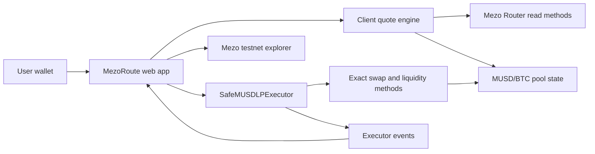

# MezoRoute — MVP Product & Technical Specification

**Hackathon:** Build with MUSD and Mezo — Bitcoin's Economic Layer  
**Version:** 1.0  
**Status:** Scope frozen for Wave 1  
**Network:** Mezo Testnet (chain ID `31611`)  
**Primary persona:** Individual DeFi user holding or borrowing MUSD

> Implementation handoff: AI agents and contributors must use
> [`AGENTS.md`](../AGENTS.md) and
> [`IMPLEMENTATION_SPEC.md`](./IMPLEMENTATION_SPEC.md)
> for the current task ledger, frozen implementation decisions, and validation gates.

---

## 1. Executive decision

MezoRoute is a **safe preview and execution layer for MUSD strategies**.

The Wave 1 MVP supports one complete, verified route:

> Deposit MUSD into the Mezo MUSD/BTC basic liquidity pool, understand the real execution cost, receive an attributable transaction receipt, monitor the LP position, and safely exit back to MUSD.

The MVP is intentionally narrow:

- Product/UX is the primary differentiator.
- One minimal, non-custodial smart contract isolates user funds and enforces execution constraints.
- The UI never presents wallet-balance changes as strategy profit.
- No unverified APY, fake yield, arbitrary routing, automated rebalancing, or cross-chain execution is included in Wave 1.

## 2. Problem

An individual MUSD user faces three practical problems:

1. **Strategy discovery:** It is difficult to know which Mezo pools are currently usable.
2. **Execution risk:** A quoted route can still suffer from price impact, slippage, deadline expiry, or poor liquidity.
3. **Misleading accounting:** Wallet balance deltas can include unrelated token movements and therefore do not prove strategy performance.

Our on-chain test found a concrete example of the third problem. Before our transaction, the official testnet Router contained `10.465776660570163868 MUSD`. The generic zap returned that pre-existing balance to the current caller together with the caller's own remainder. A naïve dashboard would have reported a false profit of more than 10 MUSD.

## 3. Target user and job to be done

### Primary persona

A retail DeFi user who:

- already holds or has borrowed MUSD;
- understands deposit, withdraw, and slippage at a basic level;
- does not want to manually calculate pool ratios or inspect transaction logs;
- wants transparent control rather than a black-box managed vault.

### Job to be done

> When I want to use my MUSD productively, help me understand the real outcome and risks before signing, execute only within my limits, and show me exactly what my transaction produced.

## 4. Research evidence and product decisions

| Finding | Evidence | Product decision |
|---|---|---|
| Borrowing MUSD on Mezo testnet works | Verified borrow transaction and live Trove state | Read and display borrow health, but do not rebuild the borrowing protocol |
| MUSD/BTC basic LP supports a full entry and exit | Verified 20 MUSD round trip | Use as the only executable Wave 1 strategy |
| Round-trip execution returned `19.988002574284855609 MUSD` from 20 MUSD | Transaction logs | Show attributable execution cost, not only output balance |
| MUSD/mUSDC testnet pricing is materially imbalanced | Live quote/reserve inspection | Mark unavailable/unsafe; do not execute |
| MUSD/mUSDT has no usable testnet liquidity | Live pool inspection | Mark unavailable |
| Testnet gauge reward rate was zero during research | Contract read | Do not advertise MEZO emissions or APY |
| No official Savings Vault testnet deployment was identified | Documentation and deployment inspection | Mainnet discovery only; no mock strategy in the primary demo |
| Generic Router zap can sweep pre-existing Router token balances | Historical block read, receipts, and Router source | Use a dedicated safe executor built from exact swap/liquidity primitives |

## 5. Goals and success criteria

### Product goals

- Make the MUSD/BTC LP route understandable before the user signs.
- Prevent execution outside user-defined minimum outputs and deadline.
- Attribute every displayed result to the current transaction.
- Demonstrate a real, reversible on-chain flow on Mezo testnet.

### MVP success criteria

1. A user can complete `MUSD → LP → MUSD` from the UI.
2. Entry and exit each execute atomically or revert completely.
3. Preview displays expected output, minimum output, price impact/execution loss, gas estimate, and key risks.
4. Transaction receipts are derived from executor events and transaction logs.
5. Pre-existing balances in the executor or Router are never counted as user profit.
6. The executor has zero user-attributable token balance after every successful operation.
7. Temporary approvals are reset to zero after successful execution.
8. Contract tests cover happy paths, slippage reverts, expiry, residual isolation, reentrancy, and accounting invariants.

### Demo-level UX targets

- The primary action is reachable within three screens after wallet connection.
- A first-time user can explain what they receive and the main risks before confirming.
- Errors provide a recovery action rather than only exposing an RPC message.

## 6. Scope

### P0 — Required for submission

- Wallet connection and Mezo testnet network handling.
- MUSD balance and native BTC gas balance.
- Borrow-position health summary when a Trove exists.
- MUSD/BTC strategy detail and risk explanation.
- Live entry quote.
- Exact MUSD approval.
- Safe atomic entry through `SafeMUSDLPExecutor`.
- LP position view.
- Live exit quote.
- Exact LP approval.
- Safe atomic exit to MUSD.
- Event-based transaction receipt.
- Explorer links for every completed transaction.
- Loading, rejection, revert, stale quote, insufficient balance, and wrong-network states.

### P1 — Add only after P0 is stable

- Read-only cards for unavailable MUSD/mUSDC and MUSD/mUSDT routes with reasons.
- Mainnet Savings Vault discovery card clearly labelled as non-executable from testnet.
- Shareable strategy/transaction summary.

### Out of scope for Wave 1

- Cross-chain MUSD bridging or execution.
- Arbitrary tokens, pools, or user-provided routes.
- Concentrated liquidity positions.
- Gauge staking or MEZO reward claims.
- Automated compounding or rebalancing.
- Custodial deposits.
- Fiat on-ramp.
- Governance.
- Backend account system.
- Claimed or simulated APY presented as live yield.
- A custom borrowing market.

## 7. User flows

### Flow A — Connect and assess readiness

1. User opens MezoRoute.
2. User connects a wallet.
3. App requests/switches to Mezo testnet.
4. App reads:
   - wallet address;
   - MUSD balance;
   - native BTC gas balance;
   - MUSD/BTC LP balance;
   - Trove collateral, debt, and current collateral ratio when available.
5. App shows one of:
   - **Ready:** sufficient MUSD and gas;
   - **Needs gas:** insufficient BTC for transactions;
   - **No MUSD:** directs user to Mezo borrowing;
   - **Trove at risk:** warns before presenting a deposit action.

The app does not prevent a user from using wallet-held MUSD solely because Trove health is poor, but the warning must be explicit and persistent.

### Flow B — Preview entry

1. User selects **MUSD/BTC Liquidity**.
2. User enters an MUSD amount.
3. App fetches fresh pool reserves and quote data.
4. App displays:
   - input MUSD;
   - portion expected to swap to BTC;
   - expected BTC;
   - expected MUSD and BTC deposited;
   - expected LP tokens;
   - minimum LP tokens;
   - estimated execution loss/price impact;
   - estimated gas;
   - quote timestamp and expiry;
   - risks: BTC exposure, impermanent loss, pool liquidity, smart-contract risk.
5. App blocks confirmation when:
   - input is zero;
   - balance is insufficient;
   - gas balance is insufficient;
   - quote is expired;
   - price impact exceeds the configured hard limit;
   - contract addresses or chain ID do not match the allowlist.

### Flow C — Enter the LP position

1. User reviews a human-readable confirmation.
2. If allowance is insufficient, user signs an approval for the exact MUSD input.
3. App refreshes the quote after approval confirmation.
4. User signs the executor transaction.
5. UI shows transaction stages:
   - submitted;
   - confirming;
   - confirmed and parsing receipt;
   - completed.
6. Receipt shows only event-attributable values:
   - exact MUSD pulled;
   - MUSD swapped;
   - BTC received;
   - MUSD/BTC added;
   - LP minted;
   - transaction-attributable residue returned;
   - gas used;
   - explorer link.

### Flow D — Monitor position

1. App reads the user's LP balance.
2. App estimates the current underlying MUSD and BTC using pool reserves and total LP supply.
3. App shows:
   - LP balance;
   - estimated underlying tokens;
   - current BTC exposure;
   - estimated exit value in MUSD;
   - difference from attributable entry value.
4. The difference is labelled **estimated position value change**, not realized profit or APY.

### Flow E — Exit to MUSD

1. User selects an LP amount or **Max**.
2. App quotes removal amounts and BTC-to-MUSD swap output.
3. App displays expected MUSD out, minimum MUSD out, price impact, and gas.
4. User approves the exact LP amount if needed.
5. User signs `exitToMusd`.
6. Contract atomically removes liquidity, swaps transaction-attributable BTC to MUSD, validates `minMUSDOut`, and transfers exact MUSD delta to the recipient.
7. Receipt shows realized, transaction-attributable MUSD output and explorer link.

## 8. Functional requirements

| ID | Requirement | Acceptance criteria |
|---|---|---|
| FR-01 | Network validation | Write actions are disabled unless chain ID is `31611` |
| FR-02 | Balance reads | MUSD, BTC gas, and LP balances refresh after each confirmed transaction |
| FR-03 | Trove health | Existing collateral, debt, and collateral ratio are displayed; missing Trove is handled cleanly |
| FR-04 | Entry quote | Quote includes expected swap output, liquidity inputs, LP output, minimums, gas, and expiry |
| FR-05 | Risk gate | UI rejects zero input, stale quote, insufficient balances, and price impact above the hard limit |
| FR-06 | Exact approval | Default approval amount equals the intended transaction amount |
| FR-07 | Atomic entry | A failed swap, liquidity add, min-LP check, or deadline check reverts the full operation |
| FR-08 | Position reads | LP balance and estimated underlying amounts are displayed from current chain state |
| FR-09 | Exit quote | Quote includes removal amounts, BTC swap output, total expected MUSD, minimum MUSD, gas, and expiry |
| FR-10 | Atomic exit | A failed removal, swap, minimum-output check, or deadline check reverts the full operation |
| FR-11 | Attributable receipt | Receipt values come from executor events and decoded logs, never from wallet delta alone |
| FR-12 | Residual isolation | Tokens held before a call cannot be transferred to or credited to the caller |
| FR-13 | Explorer traceability | Every success receipt links to the Mezo testnet explorer |
| FR-14 | Error recovery | Each user-facing error provides Retry, Refresh Quote, Switch Network, or Add Gas as appropriate |

## 9. UX and screen specification

### Screen 1 — Dashboard

Components:

- wallet/network control;
- MUSD balance;
- BTC gas balance;
- borrow health card;
- strategy card: **MUSD/BTC Liquidity**;
- unavailable route cards with explicit reasons.

Primary CTA: **Preview strategy**

### Screen 2 — Strategy detail

Sections:

- amount input and Max shortcut;
- “What happens” allocation visualization;
- expected outcome;
- cost and slippage;
- risk disclosures;
- quote expiry indicator.

Primary CTA: **Review transaction**

### Screen 3 — Confirmation

Must state:

- exact MUSD being authorized;
- expected and minimum LP;
- maximum acceptable deviation;
- deadline;
- number of signatures remaining;
- no-custody statement.

Primary CTA changes by state:

- **Approve exact amount**
- **Refresh quote**
- **Enter position**

### Screen 4 — Transaction progress and receipt

Progress states:

- awaiting signature;
- submitted;
- confirming;
- confirmed;
- failed.

Success receipt includes executor event fields, gas, block, and explorer link.

### Screen 5 — Position and exit

Components:

- LP balance;
- estimated underlying MUSD/BTC;
- attributable cost basis from entry events;
- estimated current exit value;
- exit amount selector;
- exit quote and risks.

Primary CTA: **Review exit**

### Copy rules

- Never say “guaranteed”, “risk-free”, or “earn X%” without a verifiable source.
- Use “estimated” for all pre-transaction values.
- Use “realized output” only after a confirmed transaction.
- Explain impermanent loss in one sentence before linking to deeper detail.
- Separate testnet execution data from mainnet discovery data visually and textually.

## 10. System architecture



### Components

#### Web app

- Wallet connection and network switching.
- Read-only chain queries.
- Quote calculation and expiration.
- Risk gates.
- Transaction lifecycle.
- Event and receipt decoding.
- No backend required for P0.

#### Quote engine

Uses official Router/pool reads:

- `getAmountsOut`
- `quoteAddLiquidity`
- `quoteRemoveLiquidity`
- `getReserves`
- pool `totalSupply`

The quote engine must attach:

- source block number;
- generated timestamp;
- deadline;
- user-selected slippage;
- contract-address allowlist version.

#### SafeMUSDLPExecutor

A non-upgradeable, route-specific, non-custodial contract. It accepts no arbitrary route or token addresses from users.

## 11. Smart contract specification

### Fixed dependencies

All dependencies are immutable:

| Dependency | Mezo testnet address |
|---|---|
| MUSD | `0x118917a40FAF1CD7a13dB0Ef56C86De7973Ac503` |
| Native BTC wrapper | `0x7b7C000000000000000000000000000000000000` |
| Basic Router | `0x9a1ff7FE3a0F69959A3fBa1F1e5ee18e1A9CD7E9` |
| PoolFactory | `0x4947243CC818b627A5D06d14C4eCe7398A23Ce1A` |
| MUSD/BTC pool | `0xd16A5Df82120ED8D626a1a15232bFcE2366d6AA9` |

Pool type is fixed as volatile: `stable = false`.

### Proposed public interface

```solidity
interface ISafeMUSDLPExecutor {
    struct EnterParams {
        uint256 musdIn;
        uint256 musdToSwap;
        uint256 minBtcFromSwap;
        uint256 minMusdAdded;
        uint256 minBtcAdded;
        uint256 minLpOut;
        uint256 deadline;
        address recipient;
    }

    struct ExitParams {
        uint256 liquidityIn;
        uint256 minMusdRemoved;
        uint256 minBtcRemoved;
        uint256 minMusdFromSwap;
        uint256 minMusdOut;
        uint256 deadline;
        address recipient;
    }

    function enterMusdBtc(
        EnterParams calldata params
    ) external returns (uint256 liquidityOut);

    function exitToMusd(
        ExitParams calldata params
    ) external returns (uint256 musdOut);
}
```

Final signatures may be compressed into calldata structs, but the safety fields and fixed route must remain.

### Entry algorithm

1. Revert on zero input, invalid recipient, or expired deadline.
2. Snapshot executor MUSD and BTC balances.
3. Pull exactly `musdIn` from caller.
4. Approve exactly `musdToSwap` to Router.
5. Call `swapExactTokensForTokens` on the fixed MUSD→BTC volatile route, output to executor.
6. Require BTC delta ≥ `minBtcFromSwap`.
7. Approve exact transaction-attributable MUSD/BTC balances for liquidity.
8. Call `addLiquidity`, minting LP directly to `recipient`.
9. Require returned MUSD/BTC usage and LP output to satisfy all minimums.
10. Return only transaction-attributable MUSD/BTC residue to `recipient`.
11. Reset Router allowances to zero.
12. Assert final executor balances are not below their starting snapshots.
13. Emit `Entered`.

### Exit algorithm

1. Revert on zero LP input, invalid recipient, or expired deadline.
2. Snapshot executor MUSD and BTC balances.
3. Pull exactly `liquidityIn` LP from caller.
4. Approve exact LP amount to Router.
5. Call `removeLiquidity`, outputting MUSD/BTC to executor.
6. Require removal deltas to satisfy `minMusdRemoved` and `minBtcRemoved`.
7. Swap only the transaction-attributable BTC delta to MUSD.
8. Calculate `musdOut = finalMUSDBalance - startingMUSDBalance`.
9. Require `musdOut >= minMusdOut` and swap result ≥ `minMusdFromSwap`.
10. Transfer exactly `musdOut` to `recipient`.
11. Return any attributable BTC dust to `recipient`.
12. Reset Router allowances to zero.
13. Emit `Exited`.

### Events

```solidity
event Entered(
    address indexed caller,
    address indexed recipient,
    uint256 musdIn,
    uint256 musdSwapped,
    uint256 btcFromSwap,
    uint256 musdAdded,
    uint256 btcAdded,
    uint256 liquidityOut,
    uint256 musdRefund,
    uint256 btcRefund
);

event Exited(
    address indexed caller,
    address indexed recipient,
    uint256 liquidityIn,
    uint256 musdRemoved,
    uint256 btcRemoved,
    uint256 musdFromSwap,
    uint256 musdOut,
    uint256 btcRefund
);
```

### Required custom errors

- `ZeroAmount()`
- `ZeroAddress()`
- `Expired()`
- `InsufficientSwapOutput()`
- `InsufficientLiquidityOutput()`
- `InsufficientFinalOutput()`
- `UnexpectedBalanceDecrease()`

### Security invariants

1. Only fixed MUSD, BTC, Router, factory, and pool are callable.
2. No arbitrary external call target or route is accepted.
3. All public state-changing entry points are non-reentrant.
4. All token transfers use `SafeERC20`.
5. Approval is zeroed before setting an exact non-zero allowance when required.
6. User minimums are enforced on-chain, not only in the frontend.
7. Deadline is enforced on-chain.
8. Pre-existing executor balances cannot be transferred to or credited to the current caller.
9. Successful calls leave no transaction-attributable assets in the executor.
10. There is no upgrade proxy, yield promise, or hidden admin withdrawal path in P0.

## 12. Frontend data and accounting rules

### Source of truth hierarchy

1. Confirmed executor events.
2. Decoded transaction logs.
3. Current contract reads.
4. Client-side estimates.

Wallet balance deltas are never the primary source for entry cost, LP minted, or exit output.

### Cost basis

For an entry transaction:

- cost basis = `Entered.musdIn - Entered.musdRefund`;
- LP acquired = `Entered.liquidityOut`.

For partial exits, cost basis is reduced pro rata by LP tokens exited. This is a UX estimate, not tax accounting.

### Quote expiration

- Default quote lifetime: 60 seconds.
- Transaction deadline: current time + 10 minutes.
- Refresh quote after approval confirmation or any relevant block-state change.

### Default slippage

- Default UI selection: 1.0%.
- Optional presets: 0.5%, 1.0%, 2.0%.
- Display a strong warning at 2.0%.
- Never silently increase slippage.

The hard price-impact limit is a deployment configuration decided after integration tests. Initial test target: block entry above 5%.

## 13. Error-state requirements

| Condition | User message | Recovery |
|---|---|---|
| Wrong network | “MezoRoute executes on Mezo Testnet.” | Switch network |
| Insufficient BTC gas | “You need test BTC to submit transactions.” | Open faucet/instructions |
| Insufficient MUSD | “Amount exceeds your available MUSD.” | Use Max or open borrow flow |
| Trove health warning | “Using borrowed MUSD does not reduce your debt.” | Review position |
| Quote expired | “Pool state changed; refresh your quote.” | Refresh quote |
| Price impact too high | “This trade would lose too much value at current liquidity.” | Reduce amount |
| User rejected signature | “Transaction was not signed.” | Try again |
| Slippage revert | “Output fell below your minimum.” | Refresh quote |
| RPC unavailable | “Mezo testnet is temporarily unavailable.” | Retry |
| Unknown revert | Human-readable fallback plus shortened error data | Retry or copy details |

## 14. Test plan

### Contract unit tests

- entry happy path;
- exit happy path;
- zero input;
- zero recipient;
- expired deadline;
- insufficient swap output;
- insufficient liquidity minted;
- insufficient final MUSD output;
- exact approval reset;
- token residue refund;
- reentrancy attempt;
- tokens accidentally sent before the call remain isolated;
- multiple callers cannot claim one another's balances.

### Fuzz and invariant tests

- For arbitrary valid inputs, caller cannot receive more than transaction-attributable deltas.
- Executor post-balance is always ≥ its pre-balance.
- A successful entry emits values consistent with Router returns and balance deltas.
- A successful exit emits `musdOut` equal to the amount transferred to recipient.
- No successful call leaves a non-zero transaction-attributable allowance.

### Fork/integration tests

- Use Mezo testnet RPC or a pinned state snapshot.
- Verify fixed addresses contain bytecode.
- Compare frontend quote to actual executor event.
- Run complete `MUSD → LP → MUSD` round trip.
- Seed executor with unrelated MUSD/BTC before the test and prove the user cannot receive or be credited for it.
- Confirm explorer-visible event decoding.

### Frontend tests

- Quote loading and expiry.
- Wallet/network transitions.
- Approval and transaction state machine.
- Receipt parsing.
- Partial and full exit.
- All error states in Section 13.

## 15. Definition of done

Wave 1 is complete only when:

- `SafeMUSDLPExecutor` is deployed and verified on Mezo testnet.
- Contract unit, fuzz, and integration tests pass.
- A fresh wallet can execute the complete entry and exit flow from the UI.
- The UI never reports the historical Router residue as profit.
- The demo transaction can be reproduced from documented steps.
- README contains setup, architecture, deployed addresses, limitations, and testnet demo links.
- A 90-second demo can be completed without manual contract calls.

## 16. Delivery roadmap

### Milestone 1 — Contract spike

- Scaffold Foundry project.
- Implement fixed-route executor.
- Write happy-path and residual-isolation tests.
- Run against Mezo testnet state.

Exit criterion: contract can reproduce the 20 MUSD round trip without using generic `zapIn`/`zapOut`.

### Milestone 2 — Contract hardening and deployment

- Complete unit/fuzz/invariant suite.
- Review calldata minimums and event schema.
- Deploy to Mezo testnet.
- Verify source.
- Run one real-wallet entry and exit.

Exit criterion: all safety invariants hold and the deployment has reproducible transaction links.

### Milestone 3 — Product vertical slice

- Build wallet/network layer.
- Implement quote engine.
- Build entry confirmation and receipt.
- Build position and exit screens.

Exit criterion: full UI flow works with the deployed executor.

### Milestone 4 — Submission quality

- Polish UX and responsive layout.
- Add failure recovery and empty states.
- Finalize README, architecture diagram, demo data, and video.
- Re-run clean-wallet demo.

Exit criterion: a judge can understand the problem, differentiation, and live proof without verbal assistance.

## 17. Demo script

1. Show wallet MUSD, BTC gas, and borrow health.
2. Enter 20 MUSD into the strategy preview.
3. Explain expected LP, minimum output, execution cost, and BTC/impermanent-loss risk.
4. Approve the exact amount and enter the position.
5. Open the event-based receipt and explorer transaction.
6. Show the LP position.
7. Preview and execute the full exit to MUSD.
8. Compare the attributable 20 MUSD input with the realized output.
9. Explain the Router residual-accounting discovery and how SafeExecutor prevents false attribution.

## 18. Known risks and mitigations

| Risk | Mitigation |
|---|---|
| Pool price moves between quote and execution | On-chain minimums and deadline |
| Impermanent loss | Plain-language disclosure and current exit estimate |
| Low or imbalanced liquidity | Hard price-impact gate |
| Router/pool contract risk | Fixed allowlist, narrow calls, transparent dependencies |
| Incorrect profit display | Event-based accounting |
| Pre-existing contract residues | Before/after delta isolation |
| Unlimited approvals | Exact approvals by default and reset inside executor |
| Testnet state differs from mainnet | Explicit environment labels and no extrapolated yield |
| RPC instability | Retryable reads and clear transaction state |

## 19. Deployment references

### Mezo testnet

- RPC: `https://rpc.test.mezo.org`
- Explorer: `https://explorer.test.mezo.org`
- Chain ID: `31611`

### Verified research transactions

- Borrow MUSD:  
  `https://explorer.test.mezo.org/tx/0x2c6cb4f33d812a4d508500d923a1c9870242b2c1b0a72f39e81e3117133f60b4`
- Add collateral:  
  `https://explorer.test.mezo.org/tx/0x4ad68ab5d9d7e29a3f3fe2fc34cbb053f97fcf4a98ca46517e30f0b26c3f1486`
- Generic Router zap-in research transaction:  
  `https://explorer.test.mezo.org/tx/0xd6fd1d2df28927ca9b621cb1ed13904529ca252322e92cc66d14bfaefdf1a3a1`
- Generic Router zap-out research transaction:  
  `https://explorer.test.mezo.org/tx/0x1dbd96372d9ab272aa125a13d7a1d3e6e63b5c1215a567a492a2df2759265dd5`

### Official references

- Hackathon: `https://app.akindo.io/wave-hacks/OVOO0gdrVU8379D10`
- Mezo Pools documentation: `https://mezo.org/docs/developers/features/mezo-pools`
- Router source: `https://github.com/mezo-org/tigris/blob/main/solidity/contracts/Router.sol`

## 20. Non-blocking open questions

These do not change the Wave 1 architecture:

- Final product name and visual identity.
- Whether Mezo will activate testnet gauge rewards during the event.
- Whether the team wants mainnet read-only comparison cards in the demo.
- Final price-impact hard limit after contract integration tests.
- Exact submission deadline and judging rubric if AKINDO exposes them only after sign-in.

---

## Final scope statement

Wave 1 ships one trustworthy experience:

> A user can see the real cost and risk of the Mezo MUSD/BTC LP route, enter it through a constrained non-custodial executor, verify exactly what their transaction produced, and exit safely back to MUSD.

Any feature that does not strengthen this story is deferred until the vertical slice is complete.
