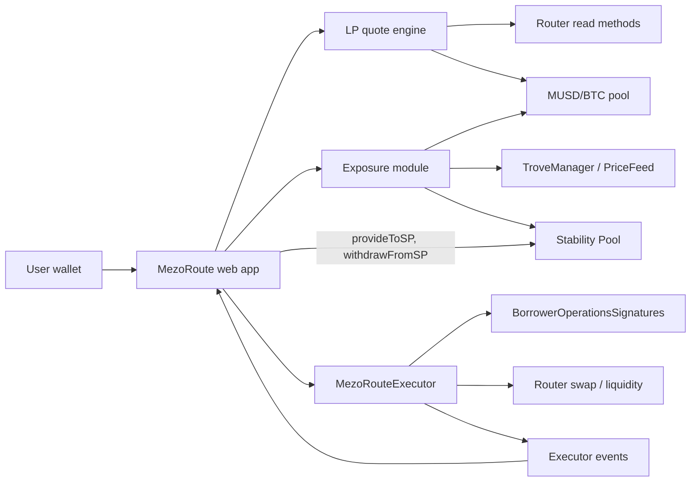

# MezoRoute — Product & Technical Specification

**Hackathon:** Build with MUSD and MEZO — Bitcoin's Economic Layer (AKINDO WaveHack)  
**Version:** 2.3  
**Status:** Scope agreed for Wave 1 and Wave 2  
**Tracks:** Track 2 — Access and Distribution (primary) and Track 1 — DeFi (Borrowing, Lending, Looping, and Yield)  
**Networks:** Mezo testnet (chain ID `31611`) and Mezo mainnet (chain ID `31612`, capped) in Wave 1  
**Team:** Solo builder  
**Primary persona:** A Mezo borrower who holds, or can borrow, MUSD against BTC

---

## 1. Executive decision

MezoRoute helps Mezo users **decide where to put their MUSD and execute that decision safely**. It compares two native MUSD destinations — the MUSD/BTC liquidity pool and the MUSD Stability Pool — on one exposure view, executes borrow → LP in a single constrained transaction, and reports every result from on-chain events.

The product is built across both Waves as one project:

| Wave | Build period | Theme |
|---|---|---|
| Wave 1 | now – 26 Oct 2026 (deadline 26 Oct 22:00) | **Market MVP**: two MUSD routes, one-transaction borrow → LP, combined exposure view, LP fee claims; live on testnet and on mainnet with a per-transaction cap; EVM and BTC wallets via Mezo Passport |
| Wave 2 | 2 Nov – 15 Nov 2026 | BTC leverage loop and unwind in one transaction (testnet and capped mainnet), judge feedback |

Work is organised as a task backlog (Section 16), not a day-by-day schedule. When the Wave 1 gate is met early, Wave 2 tasks that do not depend on judge feedback start immediately on a separate branch.

Non-negotiable product rules:

- The UI never presents wallet-balance changes as strategy profit.
- No unverified APY, simulated yield, arbitrary routing, or automated rebalancing.
- User funds never rest in MezoRoute contracts between transactions.
- The only revenue is a disclosed execution fee on executor entries, fixed at deployment and shown before signing (Section 19.1).

### Integration scope: MUSD, not MEZO

MezoRoute integrates **MUSD** deeply (borrowing via `BorrowerOperationsSignatures`, the MUSD/BTC pool, and the Stability Pool). It does **not** integrate MEZO. On-chain research (Section 4) shows that no Mezo gauge pays MEZO, veMEZO is not deployed, and mainnet MUSD/BTC pools have no gauge. The hackathon requires "MUSD and/or MEZO"; we choose a deep MUSD integration over a superficial MEZO one and state this openly in the submission.

## 2. Problem

A Mezo user who wants to put MUSD to work faces four problems:

1. **Choosing a destination.** MUSD can go into the MUSD/BTC pool or the Stability Pool. The two have very different return sources and risks, and nothing compares them side by side.
2. **Fragmented execution.** Borrowing, swapping, and adding liquidity are separate actions, approvals, and transactions.
3. **Hidden compounding of BTC risk.** A user who borrows MUSD against BTC and deposits it into a MUSD/BTC pool **increases** their BTC exposure: a BTC drawdown lowers both the Trove collateral ratio and the LP value at the same time. A Stability Pool deposit converts MUSD into BTC when liquidations happen. No interface shows these exposures together with the Trove.
4. **Misleading accounting.** Wallet balance deltas can include unrelated token movements. Velodrome-style routers (including Mezo's Tigris Router) return any balance already held by the Router to the current caller during a zap; on testnet we observed a zap return `10.465776660570163868 MUSD` of pre-existing Router balance, which a naïve dashboard would report as profit. MezoRoute derives every reported number from events.

## 3. Target user and job to be done

### Primary persona

A retail DeFi user who:

- holds BTC on Mezo and has, or is willing to open, a Trove;
- understands deposit, withdraw, collateral ratio, and slippage at a basic level;
- does not want to calculate pool ratios, Trove hints, or read transaction logs;
- wants transparent, non-custodial control rather than a managed vault;
- uses an EVM wallet (e.g. MetaMask) or a Bitcoin wallet connected through Mezo Passport, on desktop or mobile.

### Job to be done

> When I want to put my BTC-backed MUSD to work, help me choose between the available Mezo destinations by showing what each does to my BTC risk, execute my choice within my limits in as few steps as possible, and show me exactly what my transaction produced.

## 4. Research evidence and product decisions

Research performed on testnet and mainnet on 30 Sep 2026.

| Finding | Evidence | Product decision |
|---|---|---|
| Borrowing MUSD on Mezo testnet works | Verified borrow transaction and live Trove state | Borrow through Mezo's own contracts; never a custom market |
| `BorrowerOperationsSignatures` is deployed on testnet and exposes `withdrawMUSDWithSignature(amount, …, borrower, recipient, signature, deadline)` | Deployment artifacts; bytecode present at `0xD757…639e` | A contract can execute a borrow for the user with one EIP-712 signature → borrow → LP in one transaction |
| The borrow signature binds `amount`, `borrower`, `recipient`, `nonce`, `deadline`; anyone may submit it; verification is `ECDSA.recover` | `_verifySignature` source | Borrowed MUSD is always sent to the **user** (Section 11.4). EOA signers only |
| MUSD and the pool LP token implement EIP-2612 `permit` | `MUSD is ERC20Permit`; LP exposes `DOMAIN_SEPARATOR` and `nonces` | Permit replaces approval transactions for entry and exit |
| MUSD/BTC basic LP supports a full entry and exit | 20 MUSD round trip returned `19.988002574284855609 MUSD` | Executable LP route; show attributable execution cost |
| Gauges pay **BTC**, not MEZO | Testnet gauge `rewardToken = 0x7b7C…` (BTC); `Voter.rewardToken = ve.token()`; only `VeBTCVoter` is deployed | No gauge staking and no MEZO claims in scope |
| Testnet MUSD/BTC gauge exists but `rewardRate = 0`; mainnet MUSD/BTC basic and CL pools have **no gauge** | Voter `gauges(pool)` reads | Gauge staking cannot be demonstrated or carried to mainnet |
| Mainnet MUSD Stability Pool holds ≈ 14.17M of ≈ 19.79M MUSD supply (≈ 72%) | `getTotalMUSDDeposits`, `totalSupply` | The Stability Pool is the dominant MUSD destination → offered as the second route |
| Testnet Stability Pool is active: ≈ 86.2M MUSD deposits and ≈ 176 BTC collateral gains | Contract reads | Stability Pool route is demonstrable on testnet with real gains |
| `provideToSP` / `withdrawFromSP` act only for `msg.sender`; `withdrawFromSP` reverts while any Trove is under-collateralised | `StabilityPool.sol` | Stability Pool actions are called by the user directly, not through the executor; the blocked-withdrawal case is an explicit error state |
| Mainnet basic MUSD/BTC pool is small (≈ 116.9k MUSD + 1.39 BTC) | `getReserves` | The price-impact gate limits deposit size; mainnet caps are conservative |
| MUSD/mUSDC is imbalanced and MUSD/mUSDT has no liquidity on testnet | Reserve inspection | Not offered |
| Generic Router zap returns pre-existing Router balances to the caller | Receipts and Router source | Executor uses exact swap/liquidity primitives with before/after delta isolation |
| `adjustTroveWithSignature` adds collateral (`msg.value`) and changes debt in one call; the signature binds `collWithdrawal`, `debtChange`, `isDebtIncrease`, `assetAmount`, `borrower`, `recipient`, `nonce`, `deadline`; repayment is burned from the **caller**, withdrawn collateral goes to `recipient` | `BorrowerOperationsSignatures.sol`, `BorrowerOperations._moveTokensAndCollateralfromAdjustment` | Wave 2 leverage/unwind executor (Section 11.9) |
| Native BTC and the BTC ERC-20 are the same balance | Pool native balance equals `BTC.balanceOf(pool)` on testnet and mainnet | A contract holding BTC from a swap can send it as `msg.value` |
| Tigris pools support flash swaps (`Pool.swap(…, data)` calls `IPoolCallee.hook`) | Tigris `Pool.sol` | Leverage and unwind are one transaction without an external flash-loan provider |
| BTC token supports EIP-2612 permit with domain `("BTC", "1", chainId, 0x7b7C…)` | `DOMAIN_SEPARATOR` matches; a signed permit succeeded and a tampered one failed via `eth_call` | Unwind pulls BTC with a permit; no approval transaction |
| Borrowing fee 0.1%, MCR 110%, CCR 150%, minimum net debt 1,800 MUSD; neither network in recovery mode (TCR ≈ 299% testnet, ≈ 398% mainnet); BTC ≈ 83,250 MUSD | Contract reads, 30 Sep 2026 | Leverage preview includes the borrowing fee; CR safety floor for leverage is 200% |
| Mainnet basic MUSD/BTC pool holds ≈ 1.39 BTC: ~1% price impact at ≈ $1.1k and ~3% at ≈ $3.4k per transaction | Reserve maths | Mainnet leverage is capped per transaction; testnet (≈ 1,300 BTC) is used for the full demo |
| Mezo's BTC ERC-20 (`0x7b7C…`) is backed by a chain precompile: on an anvil fork even `balanceOf` reverts | Local fork spike | No fork tests. Contract tests run against the real Tigris Pool/PoolFactory/Router source deployed locally with mock tokens; real-chain behaviour is covered by a live testnet smoke script |
| Mezo supports EVM **London** only; Tigris uses Solidity 0.8.24 and OpenZeppelin 4.9.0 | Tigris `hardhat.config.ts`, `package.json` | Compile with `evm_version = london`, Solidity 0.8.24, OpenZeppelin 4.9.0 |
| Tigris LP tokens are clones whose EIP-712 domain name is empty: `("", "1", chainId, pool)` | `eip712Domain()` on the testnet pool matches `DOMAIN_SEPARATOR` | LP permit typed data uses an empty name; MUSD uses `("Mezo USD", "1")` |
| Mezo Passport (`@mezo-org/passport` 0.17.2) wraps RainbowKit/wagmi/viem and connects Bitcoin wallets through OrangeKit smart accounts; peer dependency React 18 | npm metadata | Wallet layer is Passport; BTC-wallet users are smart accounts (no `ecrecover`), so they use approvals instead of permits and cannot use Borrow & Deploy; Next.js 14 (React 18) |
| Testnet MUSD/BTC pool fee is 4 bps; mainnet default volatile fee is 30 bps | `PoolFactory.getFee(pool, false)` | Quote engine reads the fee from chain; never hardcoded |
| Tigris LP trading fees accrue in `PoolFees` and are paid only when the LP holder calls `Pool.claimFees()` | Tigris `Pool.sol` | Positions screen shows claimable fees (via `eth_call` of `claimFees` from the user) and a Claim action — the LP route's real yield on mainnet |
| Borrow authorisation is standard EIP-712 `WithdrawMUSD(uint256 amount,address borrower,address recipient,uint256 nonce,uint256 deadline)` in domain `("BorrowerOperationsSignatures", "1")` | A `cast wallet sign --data` signature passed verification on the live contract via `eth_call` (failed later only on "Trove does not exist"); a tampered amount failed with "Invalid signature" | Frontend uses `signTypedData` with this type; nonce from `getNonce(borrower)` |

## 5. Goals and success criteria

### Product goals

- Let a user compare the LP route and the Stability Pool route by return source, risk, and effect on total BTC exposure before choosing.
- Turn borrow → swap → add liquidity into **one transaction and two off-chain signatures**.
- Prevent execution outside user-defined minimums and deadlines.
- Attribute every displayed result to the current transaction.

### Wave 1 success criteria

1. A user can complete `MUSD → LP → MUSD` from the UI.
2. A user with an existing Trove can complete `borrow → LP` in one executor transaction.
3. A user can deposit MUSD into the Stability Pool, see compounded deposit and pending BTC gains, and withdraw.
4. The route comparison shows both routes' return sources, risks, fee, and exposure effect for the entered amount.
5. Executor entry and exit are atomic.
6. Previews display expected and minimum output, price impact/execution loss, fee, gas, resulting collateral ratio (when borrowing), and key risks.
7. The exposure panel shows Trove BTC, LP BTC, Stability Pool pending BTC, and the effect of a 10/20/30% BTC drawdown on collateral ratio and position values.
8. Receipts are derived from executor or Stability Pool events.
9. The executor holds no user-attributable tokens or allowances after any successful call.
10. Contract tests cover happy paths, slippage reverts, expiry, residual isolation, reentrancy, signature misuse, fee accounting, and invariants.

### Demo-level UX targets

- The primary action is reachable within three screens after wallet connection.
- A first-time user can explain the difference between the two routes before confirming.
- Errors provide a recovery action rather than only an RPC message.

## 6. Scope

### Wave 1 — Must (MVP)

- Contract hardening for mainnet: immutable per-transaction cap `maxMusdIn` on entry (none on exit), constructor check `factory == router.defaultFactory()`, the review's missing tests, and a written self-audit checklist; redeploy on testnet.
- Mainnet deployment of `MezoRouteExecutor` (cap 1,000 MUSD, fee 10 bps), source-verified.
- Frontend on Next.js 14 with Mezo Passport (EVM and Bitcoin wallets), testnet/mainnet switch, deployed publicly on Vercel.
- Dashboard: readiness state, Trove card, exposure panel with drawdown scenarios, route comparison, positions summary.
- LP route: optimal-swap quote engine, Deposit MUSD (permit, or approval for smart accounts), exit, receipts.
- Borrow & Deploy (EOA wallets): Trove hints, EIP-712 borrow authorisation, CR safety floor.
- Stability Pool route: deposit, position, withdraw, receipts.
- Positions: LP underlying, event-based cost basis, **claimable LP fees and Claim**, Stability Pool deposit and gains.
- Error decoding with recovery actions for every state in Section 13.
- README, deck, 2-minute video, submission form (Project readiness = mainnet deployment).

### Wave 1 — Should

- Mainnet reference card on testnet (pool reserves, Stability Pool deposits and share of supply).
- Quote-accuracy script comparing frontend quotes with live `Entered` events.

### Wave 1 — Could (cut first if late)

- Playwright end-to-end run on live testnet with an injected test-key provider (enter → exit).

### Wave 2 — Must

- `MezoRouteLeverage` executor: **Leverage** (flash-borrow BTC → add to Trove and borrow MUSD → repay the pool) and **Unwind** (flash-borrow MUSD → repay debt and withdraw BTC → repay the pool), each in one transaction.
- Leverage and Unwind screens with target-CR input, preview (added collateral and debt, fees, price impact, resulting CR, liquidation price), and exposure panel integration.
- Invariant suite and self-audit checklist for `MezoRouteLeverage`.
- Mainnet deployment of `MezoRouteLeverage` with an immutable per-transaction cap.
- Changes driven by Wave 1 judge feedback.

### Wave 2 — Could

- Telegram alerts when collateral ratio or combined exposure crosses a user threshold.

### Out of scope

- Gauge staking and MEZO rewards (no MEZO-paying gauge exists; Section 4).
- Opening a new Trove through the executor.
- Borrow → Stability Pool in one transaction (Stability Pool deposits are keyed to `msg.sender`).
- Smart-account / ERC-1271 signers for `borrowAndEnter` and permits (smart accounts use approvals; Borrow & Deploy is unavailable to them).
- Cross-chain MUSD, arbitrary tokens/pools/routes, concentrated liquidity.
- Automated compounding, rebalancing, or automatic deleveraging (Leverage and Unwind are always user-initiated).
- Custodial deposits, fiat on-ramp, governance, backend accounts.
- Any APY figure not computed from verifiable on-chain data.

## 7. User flows

### Flow A — Connect and assess readiness

1. User connects an EVM or Bitcoin wallet through Mezo Passport and picks Testnet or Mainnet; the app detects whether the account is an EOA or a smart account (`getCode`).
2. App reads wallet MUSD, BTC gas, LP balance, Stability Pool deposit and pending gain, and Trove state.
3. App shows one of:
   - **Ready:** sufficient MUSD and gas;
   - **Can borrow:** has a Trove with borrowing headroom;
   - **Needs gas:** insufficient BTC for transactions;
   - **No MUSD and no Trove:** links to the Mezo app to open a Trove;
   - **Trove at risk:** persistent warning before any deposit action.

The app never blocks use of wallet-held MUSD because of Trove health, but the warning is explicit and persistent.

### Flow B — Compare routes

1. User enters an MUSD amount on the dashboard.
2. App shows both routes side by side:

| | MUSD/BTC LP | Stability Pool |
|---|---|---|
| Return source | Swap fees | BTC from liquidations, acquired at a discount to debt |
| BTC price exposure | Yes — about half the position becomes BTC | Only after liquidations, as pending BTC gains |
| Other risks | Impermanent loss, pool liquidity | Deposit shrinks when absorbing liquidated debt; withdrawals blocked while any Trove is under-collateralised |
| MezoRoute fee | Execution fee (bps) | None (direct protocol call) |
| Exposure after deposit | From the exposure module | From the exposure module |

3. User picks a route and continues to its detail screen.

### Flow C — Deposit wallet MUSD into LP

1. App fetches fresh reserves and quotes, and shows input MUSD, portion swapped, expected BTC, expected MUSD and BTC deposited, expected and minimum LP, execution fee (bps and MUSD), estimated execution loss/price impact, gas, quote timestamp and expiry, exposure before/after, and risks.
2. App blocks confirmation on zero input, insufficient balance or gas, expired quote, price impact above the hard limit, or chain/address mismatch.
3. EOA: user signs a MUSD permit. Smart account (Bitcoin wallet): user sends an exact approval transaction.
4. User sends `enter`.
5. Progress: awaiting signature → submitted → confirming → confirmed → receipt.
6. Receipt shows only `Entered` event values, gas used, and an explorer link.

### Flow D — Borrow & Deploy into LP

Precondition: user has a Trove and uses an EOA wallet (the option is shown disabled with an explanation for smart accounts).

1. User enters an MUSD amount to borrow and deploy.
2. App shows everything in Flow C plus new debt, resulting collateral ratio, and the protocol minimum collateral ratio.
3. App blocks confirmation if the resulting collateral ratio falls below the UI safety floor (default: MCR + 40 percentage points, configurable in constants).
4. App computes Trove hints (`HintHelpers.getApproxHint` + `SortedTroves.findInsertPosition`) and reads the user's signature nonce.
5. User signs two typed-data messages: the borrow authorisation (`recipient` = the user's own address) and the MUSD permit to the executor.
6. User sends one `borrowAndEnter` transaction.
7. Receipt shows borrowed amount, fee, LP minted, residues, and the new Trove state read after confirmation.

### Flow E — Deposit into the Stability Pool

1. User enters an MUSD amount; app shows current deposit, pending BTC gain (which will be paid out on this deposit), exposure before/after, and risks.
2. User sends an exact MUSD approval to the Stability Pool: `provideToSP` pulls MUSD with `transferFrom` (verified in `StabilityPool._sendMUSDtoStabilityPool`), and the pool has no permit entry point.
3. User calls `StabilityPool.provideToSP(amount)` directly.
4. Receipt decodes `UserDepositChanged` and `CollateralGainWithdrawn` (BTC gain paid and MUSD loss realised).

### Flow F — Monitor positions

1. App reads LP balance and estimates underlying MUSD and BTC from reserves and LP total supply.
2. App reads Stability Pool compounded deposit and pending BTC gain.
3. App shows per-route values, attributable cost basis, estimated exit value, and the exposure panel.
4. Differences from cost basis are labelled **estimated position value change**, never profit or APY.

### Flow G — Exit LP to MUSD

1. User selects an LP amount or **Max**.
2. App quotes removal amounts and the BTC→MUSD swap; shows expected and minimum MUSD, price impact, and gas.
3. EOA: user signs an LP permit. Smart account: exact approval transaction.
4. User sends `exit`.
5. Receipt shows realised, event-attributable MUSD output. No fee is charged on exit.

### Flow G2 — Claim LP trading fees

1. Positions screen shows claimable MUSD and BTC fees, read by simulating `Pool.claimFees()` from the user's address.
2. User calls `Pool.claimFees()` directly; the receipt decodes the pool's `Claim` event.

### Flow H — Withdraw from the Stability Pool

1. User selects an amount or **Max**; app shows compounded deposit and pending BTC gain paid out with the withdrawal.
2. Before submitting, app simulates the call; if any Trove is under-collateralised, it shows the blocked-withdrawal state (Section 13) instead of sending.
3. User calls `withdrawFromSP(amount)` directly.
4. Receipt decodes `UserDepositChanged` and `CollateralGainWithdrawn`.

### Flow I — Leverage (Wave 2)

Precondition: user has a Trove and uses an EOA wallet.

1. User picks a target collateral ratio (floor 200%) or an amount of BTC to add.
2. App computes the BTC to flash-borrow, the MUSD debt increase (swap input + 0.3% pool fee + price impact + 0.1% borrowing fee), and shows resulting collateral, debt, CR, liquidation price, total BTC exposure, and drawdown scenarios.
3. User signs two typed-data messages: `AdjustTrove` (add `B` BTC, borrow `X` MUSD, `recipient` = user) and a MUSD permit for `X` to the executor.
4. User sends one `leverage` transaction. Receipt shows BTC added, MUSD debt added, fees, and the new Trove state.

### Flow J — Unwind (Wave 2)

1. User picks a target collateral ratio or a debt amount to repay (up to closing the leverage added by MezoRoute; closing the Trove itself stays in the Mezo app).
2. App computes the MUSD to flash-borrow, the BTC collateral to withdraw to repay the pool, and shows the resulting Trove and exposure.
3. User signs `AdjustTrove` (withdraw `W` BTC, repay `R` MUSD, `recipient` = user) and a BTC permit for the BTC needed to repay the pool.
4. User sends one `unwind` transaction. Leftover BTC stays with the user.

## 8. Functional requirements

| ID | Requirement | Acceptance criteria |
|---|---|---|
| FR-01 | Network validation | Write actions are disabled unless chain ID matches the configured network |
| FR-02 | Balance reads | MUSD, BTC gas, LP, Stability Pool deposit and pending gain refresh after each confirmed transaction |
| FR-03 | Trove read | Collateral, debt, and collateral ratio are displayed; a missing Trove is handled cleanly |
| FR-04 | LP entry quote | Includes swap output, liquidity inputs, LP output, fee, minimums, gas, and expiry |
| FR-05 | Risk gate | UI rejects zero input, stale quote, insufficient balances, price impact above the hard limit, and (for borrowing) a resulting CR below the safety floor |
| FR-06 | Minimal approvals | Permit by default; fallback approvals equal the exact transaction amount |
| FR-07 | Atomic entry | A failed borrow, swap, liquidity add, minimum check, or deadline reverts the whole operation |
| FR-08 | Position reads | LP and Stability Pool positions come from current chain state |
| FR-09 | LP exit quote | Includes removal amounts, swap output, expected and minimum MUSD, gas, and expiry |
| FR-10 | Atomic exit | A failed removal, swap, minimum check, or deadline reverts the whole operation |
| FR-11 | Attributable receipt | Receipt values come from executor or Stability Pool events, never from wallet delta alone |
| FR-12 | Residual isolation | Tokens held by the executor before a call cannot be transferred or credited to the caller |
| FR-13 | Explorer traceability | Every success receipt links to the explorer |
| FR-14 | Error recovery | Each error offers Retry, Refresh Quote, Switch Network, or Add Gas as appropriate |
| FR-15 | Exposure | Total BTC exposure (Trove, LP, Stability Pool pending gain) and 10/20/30% drawdown scenarios are shown on the dashboard and previews |
| FR-16 | Borrow & Deploy | One executor transaction borrows and deposits into LP; borrowed MUSD only moves between the user and the executor |
| FR-17 | Stability Pool route | Deposit, withdraw, compounded deposit, and pending BTC gain work against the live Stability Pool |
| FR-18 | Execution fee | Entry fee is shown in bps and MUSD before signing, charged on-chain exactly as shown, emitted in `Entered`, and never charged on exit or on Stability Pool actions |
| FR-19 | Route comparison | Both routes are compared for the entered amount with return source, risks, fee, and exposure effect |
| FR-20 | Leverage (Wave 2) | One transaction adds flash-borrowed BTC to the user's Trove and borrows exactly enough MUSD to repay the pool; reverts if the resulting CR is below the user's minimum |
| FR-22 | Mainnet cap | Entry above `maxMusdIn` is blocked in the UI and reverts on-chain; exit is never capped |
| FR-23 | Wallet capabilities | EOAs get permits and Borrow & Deploy; smart accounts get exact approvals and a disabled Borrow & Deploy with an explanation |
| FR-24 | LP fee claims | Claimable fees are shown per position and claimable in one transaction |
| FR-21 | Unwind (Wave 2) | One transaction repays debt with flash-borrowed MUSD and withdraws only enough BTC to repay the pool plus the user's requested amount |

## 9. UX and screen specification

**Visual direction: Calm Finance** — light background, rounded cards, generous whitespace, plain-language labels ("Earn swap fees", "Back the system"), one accent colour; responsive down to phone width.

**Navigation: one page per step.** Every page shares a header (logo, Testnet/Mainnet switch, Passport wallet button). On mainnet a persistent banner reads "Unaudited · max 1,000 MUSD per transaction". Every error toast carries a recovery action (Section 13).

| # | Page | Route | Content | Primary CTA |
|---|---|---|---|---|
| 1 | Dashboard | `/` | Readiness state; Trove card (collateral, debt, CR); exposure panel (Trove BTC, LP BTC, SP pending BTC; BTC −10/20/30%); amount input + LP vs Stability Pool comparison; positions summary; testnet-only mainnet reference card | Choose route |
| 2a | LP route | `/route/lp` | Deposit MUSD / Borrow & Deploy toggle (disabled for smart accounts); "what happens"; expected outcome; fee, slippage, price impact; resulting CR when borrowing; exposure before/after; risks; 60 s quote expiry | Review |
| 3a | LP confirm | `/route/lp/confirm` | Exact amounts, minimums, deadline; stepper: sign permit (smart account: approve) → sign borrow (if any) → send; no-custody statement | Sign / Send |
| 2b | Stability Pool | `/route/stability-pool` | Current deposit and pending BTC gain; exposure before/after; risks | Review |
| 3b | SP confirm | `/route/stability-pool/confirm` | Exact approval (skipped if allowance suffices) → `provideToSP` | Approve / Send |
| 4 | Receipt | `/tx/[hash]` | Submitted → confirming → confirmed; event-derived values; gas, block, explorer link | View positions |
| 5 | Positions | `/positions` | LP: balance, underlying, cost basis, estimated exit value, **claimable fees + Claim**; SP: compounded deposit, BTC gain | Exit / Withdraw / Claim |
| 6a | Exit LP | `/positions/lp/exit` | Percentage or Max; quote; minimum MUSD; permit (smart account: approve) → send | Exit |
| 6b | Withdraw SP | `/positions/stability-pool/withdraw` | Simulated first; blocked state when a Trove is under-collateralised | Withdraw |

### Copy rules

- Never say "guaranteed", "risk-free", or "earn X%" without a verifiable on-chain source.
- Use "estimated" for all pre-transaction values and "realised" only after confirmation.
- Explain impermanent loss, the double BTC exposure, and Stability Pool deposit loss in one sentence each before linking to detail.
- Visually and textually separate testnet execution data from mainnet reference data.
- Never imply that MezoRoute pays MEZO or gauge rewards.

## 10. System architecture



### Stack

- **Contracts:** Solidity 0.8.24, Foundry, OpenZeppelin Contracts 4.9.0 (same as Tigris), `evm_version = london`, `via_ir = true`; tests against locally deployed Tigris contracts (pinned commit `0a3b5e8`).
- **Frontend:** Next.js 14 (App Router, static export), React 18 (required by Mezo Passport), TypeScript, `@mezo-org/passport` (RainbowKit), wagmi 2, viem 2, TanStack Query 5, Tailwind CSS, Vitest.
- **Hosting:** Vercel (static); no backend. The Wave 2 Telegram alert service would be the only server component.

### Frontend module layout

```
src/lib/config/                chain, addresses (allowlist), constants
src/lib/routes/musd-btc-lp/    quote, build params, receipt decoding
src/lib/routes/stability-pool/ reads, calls, receipt decoding
src/lib/exposure/              pure functions: total BTC exposure, drawdown scenarios
src/lib/trove/                 Trove reads, hints, signature nonce, EIP-712 typed data
src/lib/tx/                    transaction state machine
src/lib/wallet/                Passport setup, EOA vs smart-account capabilities (permit vs approve, Borrow & Deploy)
src/lib/quote/                 optimal-swap maths, price impact, minimums, expiry (bigint)
src/lib/errors/                revert decoding → user message + recovery action
src/lib/history/               chunked event queries for cost basis (localStorage cache)
src/app/                       pages (Section 9)
```

Each route lives in its own directory so later routes are added rather than modifying existing ones.

## 11. Smart contract specification

The executor serves only the LP route. The Stability Pool route calls Mezo contracts directly.

### 11.1 Fixed dependencies

All dependencies are immutable constructor arguments; the executor accepts no user-supplied addresses other than `recipient`.

| Dependency | Mezo testnet | Mezo mainnet |
|---|---|---|
| MUSD | `0x118917a40FAF1CD7a13dB0Ef56C86De7973Ac503` | `0xdD468A1DDc392dcdbEf6db6e34E89AA338F9F186` |
| BTC (ERC-20 interface) | `0x7b7C000000000000000000000000000000000000` | `0x7b7C000000000000000000000000000000000000` |
| Basic Router | `0x9a1ff7FE3a0F69959A3fBa1F1e5ee18e1A9CD7E9` | `0x16A76d3cd3C1e3CE843C6680d6B37E9116b5C706` |
| PoolFactory | `0x4947243CC818b627A5D06d14C4eCe7398A23Ce1A` | `0x83FE469C636C4081b87bA5b3Ae9991c6Ed104248` |
| MUSD/BTC pool (volatile) | `0xd16A5Df82120ED8D626a1a15232bFcE2366d6AA9` | `0x52e604c44417233b6CcEDDDc0d640A405Caacefb` |
| BorrowerOperationsSignatures | `0xD757e3646AF370b15f32EB557F0F8380Df7D639e` | `0xB57ab578BF20b3e318f3EFAA587C51DBccE5df7a` |
| **MezoRouteExecutor (deployed, verified)** | `0xB36B2E012003840951CFf00fA6b1E3237A110920` (cap 1,000,000 MUSD; deployed 2 Oct 2026) | Wave 1 (M1, cap 1,000 MUSD) |

Frontend-only reads and direct calls:

| Contract | Mezo testnet | Mezo mainnet |
|---|---|---|
| BorrowerOperations | `0xCdF7028ceAB81fA0C6971208e83fa7872994beE5` | `0x44b1bac67dDA612a41a58AAf779143B181dEe031` |
| TroveManager | `0xE47c80e8c23f6B4A1aE41c34837a0599D5D16bb0` | `0x94AfB503dBca74aC3E4929BACEeDfCe19B93c193` |
| PriceFeed | `0x86bCF0841622a5dAC14A313a15f96A95421b9366` | `0xc5aC5A8892230E0A3e1c473881A2de7353fFcA88` |
| HintHelpers | `0x4e4cBA3779d56386ED43631b4dCD6d8EacEcBCF6` | `0xD267b3bE2514375A075fd03C3D9CBa6b95317DC3` |
| SortedTroves | `0x722E4D24FD6Ff8b0AC679450F3D91294607268fA` | `0x8C5DB4C62BF29c1C4564390d10c20a47E0b2749f` |
| StabilityPool | `0x1CCA7E410eE41739792eA0A24e00349Dd247680e` | `0x73245Eff485aB3AAc1158B3c4d8f4b23797B0e32` |

Fee configuration is also immutable:

| Parameter | Value |
|---|---|
| `feeBps` | Set at deployment; proposed 10 bps (0.10%) |
| `MAX_FEE_BPS` | Constant 50 bps; constructor reverts above it |
| `feeRecipient` | Set at deployment; non-zero |
| `maxMusdIn` | Immutable per-transaction entry cap; mainnet 1,000 MUSD, testnet 1,000,000 MUSD; applies to `enter` and `borrowAndEnter`, never to `exit` |

The constructor also requires `router.defaultFactory() == factory`, because `addLiquidity`/`removeLiquidity` always use the Router's default factory.

Changing the fee requires deploying a new executor; the frontend allowlist pins the executor address and its fee.

### 11.2 Public interface

```solidity
interface IMezoRouteExecutor {
    struct Permit {
        uint256 value;      // 0 = skip permit, use existing allowance
        uint256 deadline;
        uint8 v;
        bytes32 r;
        bytes32 s;
    }

    struct Borrow {
        uint256 amount;
        address upperHint;
        address lowerHint;
        bytes signature;
        uint256 deadline;
    }

    struct EnterParams {
        uint256 musdIn;
        uint256 musdToSwap;
        uint256 minBtcFromSwap;
        uint256 minMusdAdded;
        uint256 minBtcAdded;
        uint256 minLpOut;
        uint256 deadline;
        address recipient;
    }

    struct ExitParams {
        uint256 liquidityIn;
        uint256 minMusdRemoved;
        uint256 minBtcRemoved;
        uint256 minMusdFromSwap;
        uint256 minMusdOut;
        uint256 deadline;
        address recipient;
    }

    function enter(EnterParams calldata p, Permit calldata musdPermit)
        external returns (uint256 liquidityOut);

    function borrowAndEnter(Borrow calldata b, Permit calldata musdPermit, EnterParams calldata p)
        external returns (uint256 liquidityOut);

    function exit(ExitParams calldata p, Permit calldata lpPermit)
        external returns (uint256 musdOut);
}
```

### 11.3 Entry algorithm (`enter`, and the tail of `borrowAndEnter`)

1. Revert on zero input, zero recipient, or expired deadline.
2. Snapshot executor MUSD, BTC, and LP balances.
3. If `musdPermit.value > 0`, call `permit` inside `try/catch` (a front-run permit must not block the call).
4. Pull exactly `musdIn` from `msg.sender`.
5. Compute `fee = musdIn × feeBps / 10_000` (rounded down) and transfer it to `feeRecipient`. All following steps operate on `musdIn − fee`; the frontend computes `musdToSwap` and minimums on this net amount.
6. Approve exactly `musdToSwap` to the Router; swap MUSD→BTC on the fixed volatile route to the executor.
7. Require BTC delta ≥ `minBtcFromSwap`.
8. Approve exact transaction-attributable MUSD/BTC to the Router; call `addLiquidity` minting LP to `recipient`.
9. Require used amounts and LP output to satisfy all minimums.
10. Return transaction-attributable MUSD/BTC residue to `recipient`.
11. Reset all allowances to zero.
12. Assert final executor balances are not below their snapshots.
13. Emit `Entered`.

### 11.4 `borrowAndEnter`

1. Require `p.recipient == msg.sender` and `p.musdIn == b.amount`.
2. Call `BorrowerOperationsSignatures.withdrawMUSDWithSignature(b.amount, b.upperHint, b.lowerHint, msg.sender, msg.sender, b.signature, b.deadline)` — borrower **and recipient are the caller**.
3. Continue with steps 3–13 of Section 11.3 (the execution fee applies).

**Why the recipient is the user, not the executor.** The borrow signature can be submitted by anyone. If it named the executor as recipient, an attacker could copy it from the mempool and call Mezo directly: the user's debt would increase and the MUSD would land in the executor as a pre-existing balance that, by design, nobody can withdraw. With the user as recipient, a front-run only delivers the borrowed MUSD to the user's own wallet; the executor call then reverts on the consumed nonce and the user can deposit through `enter`.

Requiring `msg.sender == borrower` also prevents a third party from using a leaked signature with weaker minimums.

Verified on testnet (30 Sep 2026, tx `0xb0eb…a762`): the recipient receives exactly `amount`; the 0.1% borrowing fee is minted to the PCV and added to debt. `borrowAndEnter` used ≈ 2.12M gas (Trove interest accrual), versus ≈ 0.39M for `enter`.

### 11.5 Exit algorithm

1. Revert on zero LP input, zero recipient, or expired deadline.
2. Snapshot executor MUSD, BTC, and LP balances.
3. Optional LP permit in `try/catch`; pull exactly `liquidityIn` LP.
4. Approve exact LP to the Router; `removeLiquidity` to the executor.
5. Require removal deltas ≥ `minMusdRemoved` and `minBtcRemoved`.
6. Swap only the transaction-attributable BTC delta to MUSD.
7. `musdOut = finalMUSD − startingMUSD`; require `musdOut ≥ minMusdOut` and swap output ≥ `minMusdFromSwap`.
8. Transfer exactly `musdOut` and any attributable BTC dust to `recipient`.
9. Reset allowances to zero; emit `Exited`.

### 11.6 Events

```solidity
event Entered(
    address indexed caller,
    address indexed recipient,
    uint256 musdBorrowed,   // 0 for enter()
    uint256 musdIn,
    uint256 fee,
    uint256 musdSwapped,
    uint256 btcFromSwap,
    uint256 musdAdded,
    uint256 btcAdded,
    uint256 liquidityOut,
    uint256 musdRefund,
    uint256 btcRefund
);

event Exited(
    address indexed caller,
    address indexed recipient,
    uint256 liquidityIn,
    uint256 musdRemoved,
    uint256 btcRemoved,
    uint256 musdFromSwap,
    uint256 musdOut,
    uint256 btcRefund
);
```

### 11.7 Custom errors

`ZeroAmount()` (also: constructor cap of zero), `ZeroAddress()`, `AmountAboveCap()`, `InvalidRecipient()` (recipient is the executor or the pool, where funds would be unrecoverable), `Expired()`, `NotBorrower()`, `BorrowAmountMismatch()`, `FeeTooHigh()`, `PoolMismatch()` (constructor: pool is not `router.poolFor(MUSD, BTC, volatile, factory)`), `FactoryMismatch()` (constructor: factory is not `router.defaultFactory()`), `InvalidSwapAmount()` (`musdToSwap` is zero or not below the post-fee amount), `InsufficientSwapOutput()`, `InsufficientLiquidityOutput()`, `InsufficientFinalOutput()`, `UnexpectedBalanceDecrease()`

### 11.8 Security invariants

1. Only the fixed MUSD, BTC, Router, pool, and BorrowerOperationsSignatures are called.
2. No arbitrary call target, token, or route is accepted.
3. All state-changing entry points are `nonReentrant`.
4. All token transfers use `SafeERC20`.
5. Every allowance is exact and reset to zero before the call returns.
6. Minimums and deadlines are enforced on-chain.
7. Pre-existing executor balances can never be transferred or credited to the caller.
8. After any successful call the executor holds no transaction-attributable MUSD, BTC, or LP.
9. Borrowed MUSD is only ever sent to the borrower; `borrowAndEnter` is callable only by the borrower.
10. No upgrade proxy, owner, pause, or admin withdrawal path.
11. The fee is charged only on entry, equals `musdIn × feeBps / 10_000`, never exceeds `MAX_FEE_BPS`, and is only ever sent to the immutable `feeRecipient`.
12. An immutable per-transaction `musdIn` cap on entry (Wave 1, required before mainnet).

### 11.9 Wave 2 — `MezoRouteLeverage`

A second immutable executor; `MezoRouteExecutor` is not modified.

**Dependencies:** MUSD, BTC, the MUSD/BTC pool (flash swaps), PoolFactory (fee), BorrowerOperationsSignatures, TroveManager + PriceFeed (post-condition CR check), fee configuration as in 11.1, and an immutable per-transaction cap.

**Leverage (`leverage`)**

1. Validate caller is the borrower, deadline, and `btcToAdd ≤ cap`.
2. `pool.swap(btcOut = btcToAdd, to = executor, data)` → in `hook`:
   1. Require `msg.sender == pool` and the call originated from this executor.
   2. `adjustTroveWithSignature{value: btcToAdd}(0, debtIncrease, true, hints, borrower, recipient = borrower, signature, deadline)` — MUSD is minted to the **user**.
   3. Permit + `transferFrom(user → executor, musdRequired)`, where `musdRequired` is the exact pool input for `btcToAdd` plus the MezoRoute fee.
   4. Transfer `musdRequired − fee` to the pool; transfer the fee to `feeRecipient`.
3. After the swap: require the user's Trove CR ≥ `minCollateralRatio` (user parameter, UI floor 200%); require executor balance deltas are zero; emit `Leveraged`.
4. Any MUSD borrowed above `musdRequired` stays in the user's wallet and is reported in the event.

**Unwind (`unwind`)**

1. Validate caller, deadline, cap.
2. `pool.swap(musdOut = debtToRepay, to = executor, data)` → in `hook`:
   1. `adjustTroveWithSignature(collWithdrawal, debtToRepay, false, hints, borrower, recipient = borrower, signature, deadline)` — the executor is the caller, so the repayment is burned from the executor's flash-borrowed MUSD; withdrawn BTC goes to the **user**.
   2. BTC permit + `transferFrom(user → executor, btcRequired)`; transfer `btcRequired` to the pool.
3. Require executor balance deltas are zero; emit `Unwound`.

**Why the recipient is always the user.** Anyone can submit an `AdjustTrove` signature. For a leverage signature, a front-runner must supply the bound `assetAmount` of BTC themselves — they gift collateral to the user. For an unwind signature with the executor as recipient, a front-runner could repay the debt and strand the user's withdrawn collateral in the executor; with the user as recipient, the collateral always reaches the user. The executor then reverts on the consumed nonce and nothing is lost.

**Testing constraint.** Sending BTC as `msg.value` from a contract relies on Mezo's unified native/ERC-20 BTC balance and cannot be reproduced with a mock ERC-20. Local tests cover the flash-swap and accounting logic with a mock `BorrowerOperationsSignatures` funded via `vm.deal`; the `msg.value` path is proven by the live testnet smoke script before mainnet deployment.

**Events:** `Leveraged(borrower, btcAdded, debtIncrease, musdToPool, fee, musdSurplus)`, `Unwound(borrower, debtRepaid, btcWithdrawn, btcToPool, btcToUser)`.

## 12. Frontend data and accounting rules

### Source of truth hierarchy

1. Confirmed executor and Stability Pool events.
2. Decoded transaction logs.
3. Current contract reads.
4. Client-side estimates.

Wallet balance deltas are never the source for entry cost, LP minted, gains, or exit output.

### Cost basis

- LP: cost basis = `Entered.musdIn − Entered.musdRefund` (plus BTC refund valued at entry price, shown separately); the fee is part of cost basis and shown as its own line. Partial exits reduce cost basis pro rata by LP exited. Reconstructed client-side from the user's `Entered`/`Exited` logs.
- Stability Pool: cost basis = sum of `provideToSP` amounts minus withdrawals, from `UserDepositChanged` history; deposit loss and BTC gains come from `CollateralGainWithdrawn`.
- This is a UX estimate, not tax accounting.

### Exposure model

Inputs: Trove collateral (BTC) and debt (MUSD); BTC price from the MUSD `PriceFeed`; minimum collateral ratio from the protocol; LP balance, pool reserves, and LP total supply; Stability Pool compounded deposit and pending BTC gain.

- LP underlying BTC = `lp / totalSupply × reserveBTC`.
- Total BTC exposure = Trove collateral + LP underlying BTC + Stability Pool pending BTC gain.
- For drawdown `d ∈ {10%, 20%, 30%}`, with `p' = p × (1 − d)`:
  - collateral ratio' = `collateral × p' / debt`;
  - LP value' (MUSD) ≈ `LP value × √(1 − d)` (constant-product, fees ignored; labelled as an approximation);
  - Stability Pool value' = compounded deposit + pending gain × `p'` (does not model new liquidations triggered by the drawdown; labelled);
  - flag when collateral ratio' < minimum collateral ratio.

The exposure module is pure TypeScript with unit tests; it is reused by the Wave 2 alert service.

### LP quote engine

- Pool fee `f` is read from `PoolFactory.getFee(pool, false)` (testnet 4 bps, mainnet 30 bps).
- Optimal MUSD to swap for a single-sided deposit of net amount `a` (after the MezoRoute fee) into reserve `r` of MUSD: `s = (√(r²(2−f)² + 4(1−f)·a·r) − r(2−f)) / (2(1−f))`, computed in `bigint` with Newton's integer square root.
- Expected BTC, deposited amounts, and LP are computed from post-swap reserves; LP = `min(musdAdded·supply/rMUSD', btcAdded·supply/rBTC')`.
- Minimums = expected × (1 − slippage); price impact is measured against the pre-trade mid price.
- Exit: `quoteRemoveLiquidity`, then the BTC→MUSD swap on post-removal reserves.
- Every quote records its block number and timestamp.

### Positions data

- Cost basis history: `Entered`/`Exited` logs filtered by the indexed `recipient`, and Stability Pool `UserDepositChanged`/`CollateralGainWithdrawn` logs by depositor, queried in block chunks from each contract's deployment block; cached in `localStorage` as a convenience only.
- Claimable LP fees: `eth_call` of `Pool.claimFees()` with `from = user`.
- Stability Pool: `getCompoundedMUSDDeposit`, `getDepositorCollateralGain`.

### Quote expiration, slippage, and limits

- Quote lifetime 60 seconds; transaction and signature deadline now + 10 minutes.
- Refresh quote after each signature and on relevant block-state change.
- Slippage presets 0.5% / 1.0% (default) / 2.0%, strong warning at 2.0%, never silently increased.
- Price-impact hard limit starts at 5% and is finalised after integration tests.

## 13. Error-state requirements

| Condition | User message | Recovery |
|---|---|---|
| Wrong network | "MezoRoute executes on Mezo Testnet." | Switch network |
| Insufficient BTC gas | "You need test BTC to submit transactions." | Open faucet |
| Insufficient MUSD | "Amount exceeds your available MUSD." | Use Max, or Borrow & Deploy |
| Trove health warning | "Using borrowed MUSD does not reduce your debt, and an LP deposit adds BTC exposure." | Review exposure |
| CR below safety floor | "This borrow would leave your Trove too close to liquidation." | Reduce amount |
| Smart-account wallet on Borrow & Deploy | "Borrow & Deploy needs a standard wallet signature." | Use Deposit MUSD |
| Borrow signature already used | "Your borrow authorisation was already used; the MUSD is in your wallet." | Deposit MUSD |
| Stability Pool withdrawal blocked | "Withdrawals are paused while some Troves are under-collateralised." | Retry later |
| Amount above mainnet cap | "Mainnet deposits are limited to 1,000 MUSD per transaction while unaudited." | Reduce amount |
| Smart-account wallet needs an approval | "Your Bitcoin wallet approves the exact amount in a separate transaction." | Approve |
| Quote expired | "Pool state changed; refresh your quote." | Refresh quote |
| Price impact too high | "This trade would lose too much value at current liquidity." | Reduce amount |
| User rejected signature | "Transaction was not signed." | Try again |
| Slippage revert | "Output fell below your minimum." | Refresh quote |
| RPC unavailable | "Mezo testnet is temporarily unavailable." | Retry |
| Unknown revert | Human-readable fallback plus shortened error data | Retry or copy details |

## 14. Test plan

### Contract tests

Environment: the real Tigris `Pool`, `PoolFactory`, and `Router` source at commit `0a3b5e8`, deployed locally with mock MUSD/BTC (ERC-20 Permit) and a mock `BorrowerOperationsSignatures` that, like the real one, accepts a signature from any sender exactly once and sends MUSD to the signed recipient.

- `enter` and `exit` happy paths.
- `borrowAndEnter` happy path.
- Zero input, zero recipient, expired deadline.
- Insufficient swap output, liquidity, and final output.
- Permit: valid, front-run (already used), and skipped (`value = 0`).
- Borrow signature: wrong caller, amount mismatch, replayed nonce, expired.
- Front-run simulation: signature submitted directly to Mezo first → MUSD arrives in user wallet, executor call reverts, executor balances unchanged.
- Execution fee: exact amount, rounding on small inputs, sent only to `feeRecipient`, constructor reverts above `MAX_FEE_BPS`, no fee on `exit`.
- Allowance reset to zero.
- Residue refund; reentrancy attempt.
- Executor pre-seeded with MUSD, BTC, and LP: caller cannot receive or be credited for them.
- Full `MUSD → LP → MUSD` round trip reproducing the 20 MUSD research result without `zapIn`/`zapOut`.

### Live testnet smoke test

A `cast`-based script runs against the deployed executor: approve → `enter` → `exit` all LP, optionally `borrowAndEnter` with a real Trove and a real EIP-712 signature, then checks that executor balances did not change.

### Fuzz and invariant tests

- Caller never receives more than transaction-attributable deltas.
- Executor post-balances ≥ pre-balances for all tokens.
- Emitted values match Router returns and balance deltas.
- No successful call leaves a non-zero allowance.

### Frontend tests (Vitest)

- Optimal-swap and quote maths, checked against numbers produced by the Tigris harness.
- Exposure module (no Trove, no LP, no Stability Pool deposit, zero debt).
- Fee calculation, route comparison output, wallet-capability logic.
- Error decoder (Router and executor custom errors, OZ4 strings, OZ5 `ERC20InsufficientAllowance`, BOS and Stability Pool strings).
- Transaction state machine.
- Receipt decoding for `Entered`, `Exited`, `UserDepositChanged`, `CollateralGainWithdrawn`, pool `Claim`, using real logs recorded from the testnet smoke transactions as fixtures.

### Live checks

- Quote-accuracy script: frontend quote vs the `Entered` event of a live testnet transaction.
- Manual QA checklist on testnet with an EOA wallet and a Bitcoin wallet through Passport, and a capped mainnet round trip.
- (Could) Playwright on live testnet with an injected provider signing with the `.env` test key.

## 15. Definition of done

### Wave 1 gate

- Capped `MezoRouteExecutor` deployed and source-verified on testnet and mainnet; contract tests pass; self-audit checklist committed.
- Frontend deployed on Vercel; every page in Section 9 works on testnet with an EOA wallet and with a Bitcoin wallet through Passport.
- Mainnet: at least one real LP round trip (enter → claim fees → exit) and one Stability Pool deposit/withdraw through the UI.
- Frontend unit tests pass; quote-accuracy check within slippage tolerance.
- README includes setup, architecture, deployed addresses, limitations (including why MEZO is not integrated and the unaudited cap), and demo links.
- 2-minute video recorded from the production deployment.
- Repository tagged `wave1`; submission sent before 26 Oct 22:00 with one day of buffer.
- Submission form: Project readiness = "mainnet deployment".

### Wave 2 gate

- Leverage and Unwind work from the UI on testnet and pass the live smoke run.
- `MezoRouteLeverage` deployed and verified on mainnet with a per-transaction cap, with at least one real leverage/unwind round trip.
- Submission explicitly lists changes since `wave1`; Project readiness = "mainnet deployment".

## 16. Task backlog

Before 16 Oct only research is done; product code starts on 16 Oct.

### T0 — Pre-research (before 16 Oct)

Done on 30 Sep 2026: all contract addresses (Section 11.1), LP permit support, gauge/MEZO status, Stability Pool state.

Remaining:

- (Done 30 Sep) BTC permit verified; `adjustTroveWithSignature` semantics, flash-swap hook, and fee/MCR parameters read.
- (Done 30 Sep) `provideToSP` requires a prior MUSD allowance (`transferFrom`).
- Short user check: ask 3–5 Mezo Discord users where they put borrowed MUSD and how many steps it takes; keep 1–2 quotes for the deck.
- Count the actions needed today in the Mezo app for borrow → LP (for the deck comparison).
- Ask the Mezo team on Discord whether MEZO utility for integrators (e.g. veMEZO) is planned during the event; if yes, revisit scope for Wave 2.

### Wave 1 — Done (30 Sep 2026)

T1 scaffold, T2 enter/exit + fee, T3 testnet deploy + verify, T8 permit (contract), T9 `borrowAndEnter` + live smoke, T12 fuzz/invariants.

C1 done 2 Oct 2026: capped executor `0xB36B…0920` on testnet, self-audit checklist in `contracts/SELF_AUDIT.md`.

### Wave 1 — MVP backlog (in order)

| ID | Task | Depends on |
|---|---|---|
| C1 | Contract hardening: `maxMusdIn` cap, `defaultFactory` check, review's missing tests, self-audit checklist; redeploy testnet | — |
| S1 | Spike: Passport + Next.js 14 static export on Vercel; Bitcoin-wallet connect, approve, `enter` on testnet | — |
| F1 | App shell: Next.js 14, Passport, network switch, config per network, header/banner, error decoder | S1 |
| F2 | Dashboard: readiness, Trove card, exposure module + panel | F1 |
| F3 | LP quote engine (optimal swap) + LP route page + confirm stepper (permit/approve) + receipt page | F1, C1 |
| F4 | Borrow & Deploy (hints, EIP-712, CR floor) | F3 |
| F5 | Stability Pool route + confirm + receipt | F1 |
| F6 | Route comparison on dashboard | F2, F3, F5 |
| F7 | Positions: LP underlying, cost basis, claimable fees + Claim, exit; SP withdraw | F3, F5 |
| F8 | Mainnet reference card; quote-accuracy script | F3 |
| M1 | Mainnet deployment (cap 1,000 MUSD) + verification; mainnet config in frontend; real round trip | C1, F7 |
| V1 | Vercel production deploy; QA checklist on both wallet types | all F |
| D1 | README, deck, 2-minute video, submission form | V1, M1 |
| E1 (Could) | Playwright live-testnet end-to-end | V1 |

### Wave 2 — starts as soon as the Wave 1 gate is met, on a separate branch

| ID | Task | Depends on |
|---|---|---|
| W2-1 | `MezoRouteLeverage`: leverage + unwind with mock-BOS tests | Wave 1 gate |
| W2-2 | Leverage and Unwind screens | W2-1, T11 |
| W2-3 | Live testnet smoke run of leverage and unwind | W2-1 |
| W2-4 | Invariant suite and self-audit checklist for `MezoRouteLeverage` | W2-1 |
| W2-5 | Mainnet deployment of `MezoRouteLeverage` with an immutable cap | W2-3, W2-4 |
| W2-6 | Judge feedback changes | Wave 1 results (~1 Nov) |
| W2-7 (Could) | Telegram CR/exposure alerts reusing the exposure module | T11 |

Wave 2 work must not be included in the Wave 1 submission.

## 17. Demo script (2 minutes)

1. Dashboard: Trove, balances, and the exposure panel.
2. Enter 20 MUSD: route comparison shows LP vs Stability Pool — return source, risk, fee, exposure after.
3. Choose LP → Borrow & Deploy: preview shows LP, minimums, fee, resulting collateral ratio.
4. Sign two messages, send one transaction; event-based receipt and explorer link.
5. Deposit into the Stability Pool; show compounded deposit and pending BTC gain.
6. Positions: drawdown scenarios across Trove, LP, and Stability Pool.
7. Exit LP to MUSD; compare attributable input with realised output.
8. Close: event-based accounting, and the Wave 2 mainnet plan.

## 18. Known risks and mitigations

| Risk | Mitigation |
|---|---|
| Pool price moves between quote and execution | On-chain minimums and deadline |
| Impermanent loss and double BTC exposure | Plain-language disclosure; exposure panel; CR safety floor |
| Stability Pool deposit loss and blocked withdrawals | Disclosure in comparison; explicit error state; simulation before sending |
| Borrow signature front-run | Recipient is always the user; caller must be the borrower |
| Permit front-run | `try/catch` permit, fall back to existing allowance |
| Low liquidity (mainnet pool ≈ 117k MUSD) | Hard price-impact gate; conservative mainnet cap |
| Router, pool, or MUSD contract risk | Fixed allowlist, narrow calls, transparent dependencies |
| No MEZO integration lowers the Integration score | Deep MUSD integration across three protocol surfaces; rationale stated in submission; revisit if Mezo announces MEZO utility |
| Incorrect profit display | Event-based accounting |
| Pre-existing contract residues | Before/after delta isolation |
| Unaudited contract on mainnet (Wave 2) | Invariant suite, self-audit, immutable per-transaction cap |
| Leverage amplifies liquidation risk | CR floor 200% in UI; on-chain `minCollateralRatio` check; liquidation price and drawdown scenarios in preview; Unwind always available |
| Thin mainnet BTC liquidity for leverage | Small per-transaction cap; price-impact gate; full-size demo on testnet |
| `msg.value` path not testable locally | Mock-based tests for logic; mandatory live testnet smoke run before mainnet |
| Solo schedule overrun | Task tiers with explicit cut order |
| Mezo Passport / OrangeKit (beta) fails for Bitcoin wallets | Spike S1 first; fallback: Passport for EVM wallets only, Bitcoin-wallet support documented as next milestone |
| Real funds on an unaudited contract | Immutable 1,000 MUSD cap, no custody between transactions, self-audit, visible "Unaudited" banner |
| RPC instability | Retryable reads, clear transaction state |

## 19. Submission positioning and business model

### 19.1 Business model

- **Execution fee:** a fixed number of basis points on MUSD entering the LP route through the executor (`enter` and `borrowAndEnter`), proposed at 10 bps, hard-capped at 50 bps in the contract.
- **No exit fee and no Stability Pool fee:** users can always leave at zero protocol cost; Stability Pool actions are direct protocol calls.
- **Transparency:** the fee is shown in bps and MUSD before signing, emitted in `Entered`, and immutable per deployment.
- **Live from Wave 1:** the capped mainnet executor charges the fee on real deposits; the testnet executor charges the same fee for demos.
- **Value to Mezo:** Borrow & Deploy mints new MUSD and deepens the MUSD/BTC pool; the route comparison directs idle MUSD into Mezo's own destinations. The deck states this with mainnet MUSD supply, Stability Pool share, and pool reserves.

### 19.2 Submission form

- **Category:** Borrowing and yield execution
- **TL;DR:** MezoRoute shows Mezo borrowers where to put their MUSD — LP or Stability Pool — by what it does to their BTC risk, and executes borrow → LP (and, in Wave 2, BTC leverage loops) in one safe transaction.
- **Tracks:** Track 2 (primary story: discover, compare, and access MUSD destinations) and Track 1 (borrow → deploy strategy; Wave 2 looping)
- **Chain:** Mezo mainnet (capped) and Mezo testnet
- **Business model:** disclosed execution fee in bps on LP entry; no exit fee (Section 19.1).
- **MUSD/MEZO usage:** borrows MUSD through `BorrowerOperationsSignatures`, deploys it into the MUSD/BTC pool, and supports Stability Pool deposits; MEZO is not integrated because no MEZO-paying surface exists for this use case (Section 1).
- **Future milestones:**
  1. Wave 2 (by 15 Nov): one-transaction BTC leverage and unwind on MUSD Troves, on testnet and capped mainnet.
  2. After the hackathon: additional routes as separate executors, and Trove opening in the same flow.
  3. After the hackathon: smart-account support and an external audit before raising caps.

## 20. Deployment references

### Mezo testnet

- RPC: `https://rpc.test.mezo.org`
- Explorer: `https://explorer.test.mezo.org`
- Chain ID: `31611`
- Faucet: `https://faucet.test.mezo.org`

### Mezo mainnet

- RPC: `https://mainnet.mezo.public.validationcloud.io` (also `https://rpc-http.mezo.boar.network`)
- Explorer: `https://explorer.mezo.org`
- Chain ID: `31612`

### Research transactions

- Borrow MUSD: `https://explorer.test.mezo.org/tx/0x2c6cb4f33d812a4d508500d923a1c9870242b2c1b0a72f39e81e3117133f60b4`
- Add collateral: `https://explorer.test.mezo.org/tx/0x4ad68ab5d9d7e29a3f3fe2fc34cbb053f97fcf4a98ca46517e30f0b26c3f1486`
- Router zap-in: `https://explorer.test.mezo.org/tx/0xd6fd1d2df28927ca9b621cb1ed13904529ca252322e92cc66d14bfaefdf1a3a1`
- Router zap-out: `https://explorer.test.mezo.org/tx/0x1dbd96372d9ab272aa125a13d7a1d3e6e63b5c1215a567a492a2df2759265dd5`

### Official references

- Hackathon: `https://app.akindo.io/wave-hacks/OVOO0gdrVU8379D10`
- Mezo developer docs: `https://mezo.org/docs/developers/`
- Mezo Pools (addresses): `https://mezo.org/docs/developers/features/mezo-pools`
- MUSD source and deployments: `https://github.com/mezo-org/musd`
- Tigris source and deployments: `https://github.com/mezo-org/tigris`

## 21. Open questions (non-blocking)

- Final execution fee value (proposed 10 bps) and fee recipient address.
- Final price-impact hard limit and CR safety floor after integration tests.
- Mainnet fee recipient address; cap for `MezoRouteLeverage` (Wave 2).
- Leverage execution fee (proposed: same 10 bps on the MUSD borrowed).
- Whether Mezo announces MEZO utility for integrators during the event.

---

## Final scope statement

> A Mezo borrower can see how the LP route and the Stability Pool route would change their total BTC risk, turn borrowed MUSD into an LP position in one previewed and constrained transaction, verify exactly what each transaction produced, and exit safely back to MUSD.

Any feature that does not strengthen this story is deferred.
